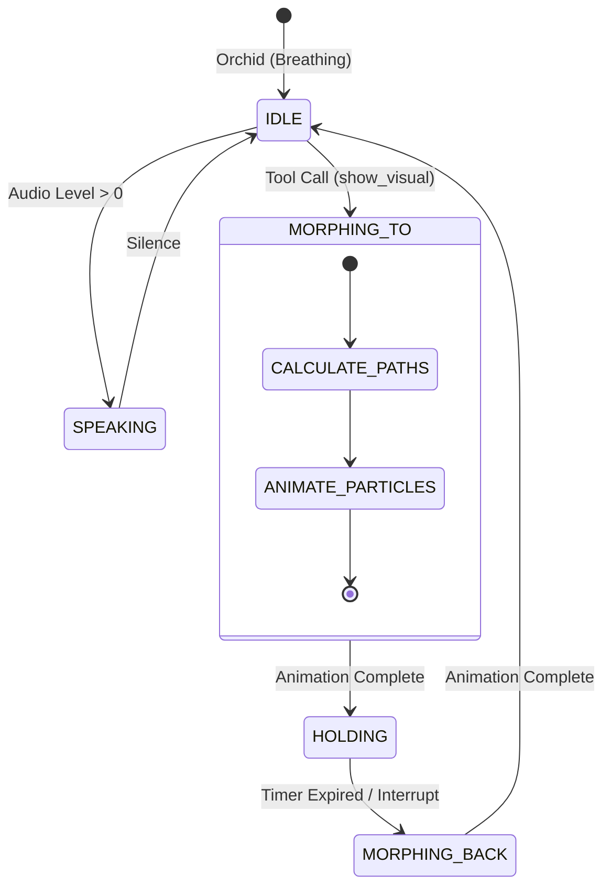

```text
   ____  ____  _____  __  __  ____  ____
  / __ \(  _ \(  _  )(  )(  )(_  _)(  _ \
 ( (__) ))   / )(_)(  )(__)(  _)(_  )(_) )
  \____/(_)\_)(_____)(______)(____)(____/
```

# Orchid: The Generative UI Plant Care Companion

> **"The pixel grid is not decoration. It is the LLM's canvas — a living surface that morphs, speaks, draws, and displays on command."**

Orchid is an advanced AI plant care companion that blends **Generative UI (Pixel Canvas)** with **Live Voice Interaction**. It transforms static plant care advice into a dynamic, visual conversation. Powered by Google's Gemini models (Flash 2.5/3 & Pro), Orchid can identify plants, diagnose issues, generate care guides, and even help you find local stores—all through a seamless voice and visual interface.

---

## 🌟 Key Features

```toml
[core_features]
voice_interaction = "Real-time, low-latency conversation with Gemini Live"
pixel_canvas = "Dynamic 70x98 grid that morphs into plant silhouettes, tools, and text"
generative_ui = "On-the-fly creation of structured artifacts (care guides, diagnosis cards)"
plant_id = "Computer vision identification of 82+ plant species"
diagnosis = "Visual symptom analysis and step-by-step treatment plans"

[integrations]
telegram = "Seamless onboarding and notifications via Telegram bot"
maps = "Location-aware store finder for plant supplies"
image_gen = "AI-generated botanical illustrations for visual guides"
```

---

## 🏗️ Architecture

Orchid is built on a modern stack emphasizing performance, real-time capabilities, and generative AI integration.

```mermaid
graph TD
    subgraph Client [Frontend (React + Vite)]
        UI[User Interface]
        PC[Pixel Canvas (PixiJS)]
        Audio[Audio Worklet]
        State[Zustand Store]
    end

    subgraph Backend [Supabase Edge Functions]
        Orch[Orchestrator Agent]
        Vision[Vision Analysis]
        GenUI[Artifact Generator]
        Auth[Auth & RLS]
    end

    subgraph AI [Google Gemini Models]
        Live[Gemini Live API]
        Flash[Gemini 1.5 Flash]
        Pro[Gemini 1.5 Pro]
        Imagen[Imagen 3 (Image Gen)]
    end

    UI --> State
    PC --> State
    Audio <--> Live
    State <--> Orch
    Orch --> Flash
    Orch --> Pro
    Orch --> Imagen
    Vision --> Flash
    Auth --> UI
```

### The Pixel Canvas Lifecycle

The heart of Orchid's visual language is the Pixel Canvas. It morphs between states based on the conversation context.



---

## 🛠️ Technology Stack

| Category | Technologies |
| :--- | :--- |
| **Frontend** |     |
| **Graphics** |   |
| **Backend** |   |
| **AI Models** |  (Flash, Pro, Live) |

---

## 🚀 Getting Started

Follow these steps to set up Orchid locally.

### Prerequisites

- Node.js (v18+)
- npm or bun
- Supabase CLI
- Google Cloud Project with Gemini API enabled

### Installation

1.  **Clone the repository**
    ```bash
    git clone https://github.com/masudl-hub/orchidcare.git
    cd orchidcare
    ```

2.  **Install dependencies**
    ```bash
    npm install
    # or
    bun install
    ```

3.  **Environment Configuration**
    Create a `.env` file in the root directory based on `.env.example`:
    ```toml
    # .env
    VITE_SUPABASE_URL = "your_supabase_url"
    VITE_SUPABASE_ANON_KEY = "your_supabase_anon_key"
    GOOGLE_API_KEY = "your_gemini_api_key"
    ```

4.  **Run Development Server**
    ```bash
    npm run dev
    ```

### Building for Production

```bash
npm run build
```

---

## 📂 Project Structure

```text
src/
├── components/
│   ├── call/           # Live call interface components
│   ├── landing/        # Landing page sections (Hero, Features)
│   ├── pixel-canvas/   # PixiJS implementation of the generative UI
│   └── ui/             # Shadcn UI reusable components
├── lib/
│   ├── pixel-canvas/   # Core logic for formations, grid sampling, animation
│   └── utils.ts        # Helper functions
├── pages/
│   ├── DemoPage.tsx    # Standalone demo experience
│   ├── OrchidPage.tsx  # Main application entry point
│   └── Settings.tsx    # User configuration
└── styles/             # Global styles and Tailwind config
supabase/
└── functions/          # Edge Functions (Telegram bot, Auth, AI Agents)
```

---

## 🎮 Usage Guide

### The Pixel Canvas

The canvas is the primary output modality. It reacts to:
*   **Voice**: Pixels pulse and expand based on audio amplitude.
*   **Context**: Mentions of specific plants (e.g., "Monstera") trigger the grid to morph into that plant's silhouette.
*   **Tools**: Advice involving tools (e.g., "watering can") displays the relevant icon.
*   **Text**: Short messages or lists are rendered directly onto the grid using a bitmap font.

### Telegram Integration

Orchid uses a Telegram-first onboarding flow:
1.  User starts `@orchidcare_bot`.
2.  Bot collects initial preferences (name, experience level).
3.  User is seamlessly authenticated into the web app via magic link.

---

## 🤝 Contributing

Contributions are welcome! Please check the `issues` tab for active tasks.

1.  Fork the project
2.  Create your feature branch (`git checkout -b feature/AmazingFeature`)
3.  Commit your changes (`git commit -m 'Add some AmazingFeature'`)
4.  Push to the branch (`git push origin feature/AmazingFeature`)
5.  Open a Pull Request

---

## 📄 License

Distributed under the MIT License. See `LICENSE` for more information.

---

> Built with ❤️ by Masud Lewis.
