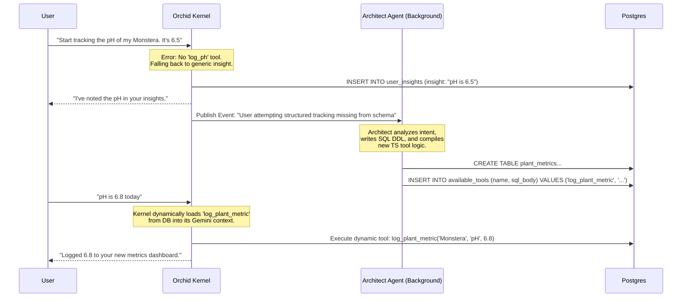

# The Real 2100 Leap: Autonomous Schemas and Self-Writing Tools

You are entirely correct: Orchid *already* operates as an Agentic loop utilizing 24 distinct read/write tools to interact deterministically with the PostgreSQL database. Replacing vector search with tool-calling isn't the "2100 vision"—that's just Orchid's *current architecture* (as documented in the 4,054-line `orchid-agent`).

If we are already operating at the bleeding edge of 2025 deterministic agentic frameworks, what does 2100 actually look like?

The real limitation right now is **Rigidity of Domain**.
Orchid knows how to handle plants, care events, and reminders because Masud Lewis wrote exactly 24 typescript tools (`analyze_environment`, `create_reminder`, `logCareEvent`) and hardcoded the `plants` and `care_events` SQL tables.

If a user wants Orchid to start tracking the *pH levels* of their hydroponic setup, or start tracking the health of their *terrarium dart frogs* alongside their orchids, the current architecture fails. There is no `log_ph_level` tool, and no `hydroponic_metrics` table.

## The 2100 Vision: The Self-Evolving Software Organism

The next paradigm is an agent that doesn't just *use* tools, but **invents them**, and doesn't just read the database, but **mutates the schema** to fit the user's evolving life.

### 1. The Autonomous Schema Mutation
Instead of a static `user_insights` table collecting unstructured facts, the system observes patterns in a user's requests and proposes new relational structures.

**Scenario:**
1. User: "My Monstera's soil pH is 6.5 today."
2. Orchid currently logs this as a generic `user_insight`.
3. Over three weeks, the user mentions pH 12 times.
4. **The 2100 Agent:** Detects structural intent. The background `Architect Agent` executes a DDL command: `ALTER TABLE plants ADD COLUMN target_ph NUMERIC; CREATE TABLE plant_metrics (plant_id UUID, metric_type VARCHAR, value NUMERIC, timestamp TIMESTAMPTZ)`.

### 2. Just-In-Time (JIT) Tool Generation
The `orchid-agent` monolith is currently 4,000+ lines because every tool must be pre-written in TypeScript.

**The 2100 Agent:** Uses a minimal kernel. The LLM is provided with a single meta-tool: `create_tool(name, schema, sql_query)`.
When the schema mutated above to track pH, the Architect Agent instantly generates a new tool: `log_plant_metric(plant_id, metric_type, value)`, compiles the SQL, and adds the tool signature to the active session.

### Architecture Data Flow: The Architect Loop

---

## Why this fundamentally breaks the 2025 paradigm:

1. **Zero-Code Feature Scaling:** You no longer need to manually write PRs to support new plant care techniques (e.g., hydroponics, light PAR meters). The software organism adapts its own data model to the user's specific hobby depth.
2. **True Personalization:** User A's Orchid database schema might have 15 tables heavily optimized for greenhouse climate control, while User B's schema remains incredibly simple for just watering reminders.
3. **Monolith Eradication:** The 4,054-line `orchid-agent` is replaced by a 200-line routing kernel that dynamically `import()`s tools compiled and stored in the database by the Architect Agent as needed.

*This* is the 2100 gap: moving from a system that requires a human engineer to write new tools to support new features, to a system that writes its own tools to accommodate the human.
