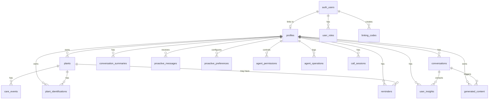

# Orchid Database Schema

> **Last Updated:** 2026-02-19
> **Database:** PostgreSQL 15 via Supabase (Lovable Cloud)
> **Source:** Direct database introspection — every value verified against live schema

---

## Table of Contents

1. [Overview](#overview)
2. [Custom Enums](#custom-enums)
3. [Tables](#tables)
4. [Foreign Keys](#foreign-keys)
5. [Indexes](#indexes)
6. [Unique Constraints](#unique-constraints)
7. [Database Functions](#database-functions)
8. [Triggers](#triggers)
9. [Storage Buckets](#storage-buckets)
10. [Realtime](#realtime)
11. [Entity Relationship Diagram](#entity-relationship-diagram)
12. [RLS Policy Patterns](#rls-policy-patterns)
13. [Important Notes for LLMs](#important-notes-for-llms)

---

## Overview

Orchid is an AI-powered plant care assistant that communicates with users via SMS, WhatsApp, Telegram, and voice calls. The system includes:

- **User Identification**: Users are identified by phone number or Telegram chat ID
- **AI Agent**: A proactive agent that can manage plants, send reminders, and provide care advice
- **Hierarchical Memory**: Conversations are summarized into compressed memories for context
- **Semantic Extraction**: User insights are extracted from conversations
- **Permission System**: Granular controls over what the AI agent can do
- **Voice Calls**: AI voice call sessions tracked with duration and summaries

### Technology Stack

| Component | Technology |
|-----------|-----------|
| Database | PostgreSQL via Supabase |
| Auth | Supabase Auth (email/password, Google OAuth) |
| SMS/WhatsApp | Twilio |
| Telegram | Bot API (`TELEGRAM_BOT_TOKEN`) |
| AI | Gemini (`@google/genai`), Perplexity (research) |
| Voice | Gemini Live API |

---

## Custom Enums

### `agent_capability`

All 14 values. These control granular agent permissions.

| Value | Description |
|-------|-------------|
| `read_plants` | Can read plant data |
| `manage_plants` | Can create/update plants |
| `read_reminders` | Can read reminders |
| `manage_reminders` | Can create/update reminders |
| `read_conversations` | Can read conversation history |
| `shopping_search` | Can search for products |
| `research_web` | Can research topics online |
| `generate_content` | Can generate care guides and content |
| `delete_plants` | Can remove plants from collection |
| `delete_notes` | Can remove care event notes |
| `delete_insights` | Can remove extracted user insights |
| `send_reminders` | Can send proactive reminder messages |
| `send_insights` | Can share insights and observations |
| `create_reminders` | Can create new scheduled reminders |

### `app_role`

| Value | Description |
|-------|-------------|
| `user` | Standard user (default) |
| `premium` | Premium features unlocked |
| `admin` | Full administrative access |

### `doctor_personality`

| Value | Description |
|-------|-------------|
| `warm` | Friendly, encouraging, uses emojis |
| `expert` | Professional, detailed, scientific |
| `philosophical` | Contemplative, poetic, nature-focused |
| `playful` | Fun, casual, uses humor |

---

## Tables

### `profiles`

**Purpose**: Core user account table. Users are identified by phone number or Telegram chat ID.

| # | Column | Type | Nullable | Default | Description |
|---|--------|------|----------|---------|-------------|
| 1 | `id` | `uuid` | NO | `gen_random_uuid()` | Primary key |
| 2 | `user_id` | `uuid` | YES | — | FK → `auth.users(id)` ON DELETE CASCADE |
| 3 | `phone_number` | `text` | YES | — | Phone number (nullable, unique constraint) |
| 4 | `whatsapp_number` | `text` | YES | — | Separate WhatsApp number if different |
| 5 | `personality` | `doctor_personality` | YES | `'warm'` | AI communication style |
| 6 | `location` | `text` | YES | — | City or ZIP code |
| 7 | `timezone` | `text` | YES | `'America/New_York'` | User's timezone |
| 8 | `notification_frequency` | `text` | YES | `'daily'` | `off`, `daily`, `weekly`, `realtime` |
| 9 | `created_at` | `timestamptz` | YES | `now()` | Account creation |
| 10 | `updated_at` | `timestamptz` | YES | `now()` | Last update (**not auto-updated — see Triggers section**) |
| 11 | `display_name` | `text` | YES | — | User's preferred name |
| 12 | `experience_level` | `text` | YES | `'beginner'` | `beginner`, `intermediate`, `expert` |
| 13 | `primary_concerns` | `text[]` | YES | — | Array: Watering, Pests, ID, General Care |
| 14 | `pets` | `text[]` | YES | `'{}'` | Pet types for toxicity warnings |
| 15 | `telegram_chat_id` | `bigint` | YES | — | Telegram chat ID (unique constraint) |
| 16 | `telegram_username` | `text` | YES | — | Telegram username |

**RLS Policies** (5 policies):

| Policy | Command | Roles | USING | WITH CHECK |
|--------|---------|-------|-------|------------|
| Deny anonymous access to profiles | SELECT | `anon` | `false` | — |
| Service role can access profiles | ALL | `service_role` | `true` | `true` |
| Users can insert their own profile | INSERT | `authenticated` | — | `auth.uid() = user_id` |
| Users can update their own profile | UPDATE | `authenticated` | `auth.uid() = user_id` | — |
| Users can view their own profile | SELECT | `authenticated` | `auth.uid() = user_id` | — |

---

### `plants`

**Purpose**: User's plant collection.

| # | Column | Type | Nullable | Default | Description |
|---|--------|------|----------|---------|-------------|
| 1 | `id` | `uuid` | NO | `gen_random_uuid()` | Primary key |
| 2 | `profile_id` | `uuid` | NO | — | FK → `profiles(id)` ON DELETE CASCADE |
| 3 | `name` | `text` | NO | — | Plant name |
| 4 | `species` | `text` | YES | — | Scientific species name |
| 5 | `nickname` | `text` | YES | — | User's nickname |
| 6 | `location_in_home` | `text` | YES | — | e.g., "Living room window" |
| 7 | `photo_url` | `text` | YES | — | URL to plant photo |
| 8 | `acquired_date` | `date` | YES | — | When user got the plant |
| 9 | `notes` | `text` | YES | — | General notes |
| 10 | `created_at` | `timestamptz` | YES | `now()` | Record creation |
| 11 | `updated_at` | `timestamptz` | YES | `now()` | Last update (**not auto-updated**) |

**RLS Policies** (3 policies):

| Policy | Command | Roles | USING | WITH CHECK |
|--------|---------|-------|-------|------------|
| Service role can manage plants | ALL | `service_role` | `true` | `true` |
| Users can manage their own plants | ALL | `public` | `profile_id IN (SELECT id FROM profiles WHERE user_id = auth.uid())` | — |
| Users can view their own plants | SELECT | `public` | `profile_id IN (SELECT id FROM profiles WHERE user_id = auth.uid())` | — |

---

### `care_events`

**Purpose**: History of care actions taken on plants.

| # | Column | Type | Nullable | Default | Description |
|---|--------|------|----------|---------|-------------|
| 1 | `id` | `uuid` | NO | `gen_random_uuid()` | Primary key |
| 2 | `plant_id` | `uuid` | NO | — | FK → `plants(id)` ON DELETE CASCADE |
| 3 | `event_type` | `text` | NO | — | `watered`, `fertilized`, `repotted`, `pruned`, `treated`, `photo` |
| 4 | `notes` | `text` | YES | — | Details |
| 5 | `photo_url` | `text` | YES | — | Photo URL |
| 6 | `created_at` | `timestamptz` | YES | `now()` | When event occurred |

**RLS Policies** (3 policies):

| Policy | Command | Roles | USING | WITH CHECK |
|--------|---------|-------|-------|------------|
| Service role can manage care events | ALL | `service_role` | `true` | `true` |
| Users can manage their plant care events | ALL | `public` | `plant_id IN (SELECT p.id FROM plants p JOIN profiles pr ON p.profile_id = pr.id WHERE pr.user_id = auth.uid())` | — |
| Users can view their plant care events | SELECT | `public` | *(same as above)* | — |

---

### `conversations`

**Purpose**: SMS/WhatsApp/Telegram message history.

| # | Column | Type | Nullable | Default | Description |
|---|--------|------|----------|---------|-------------|
| 1 | `id` | `uuid` | NO | `gen_random_uuid()` | Primary key |
| 2 | `profile_id` | `uuid` | NO | — | FK → `profiles(id)` ON DELETE CASCADE |
| 3 | `channel` | `text` | NO | — | `sms`, `whatsapp`, `telegram` |
| 4 | `message_sid` | `text` | YES | — | Twilio message SID |
| 5 | `direction` | `text` | NO | — | `inbound` or `outbound` |
| 6 | `content` | `text` | NO | — | Message text |
| 7 | `media_urls` | `text[]` | YES | — | Attached image URLs |
| 8 | `created_at` | `timestamptz` | YES | `now()` | Message timestamp |
| 9 | `summarized` | `boolean` | YES | `false` | True after processed into summary |

**RLS Policies** (5 policies):

| Policy | Command | Roles | USING | WITH CHECK |
|--------|---------|-------|-------|------------|
| Service role can manage conversations | ALL | `service_role` | `true` | `true` |
| Users can view their conversations | SELECT | `public` | `profile_id IN (...)` | — |
| Users can insert their conversations | INSERT | `authenticated` | — | `profile_id IN (...)` |
| Users can update their conversations | UPDATE | `authenticated` | `profile_id IN (...)` | `profile_id IN (...)` |
| Users can delete their conversations | DELETE | `authenticated` | `profile_id IN (...)` | — |

> All `profile_id IN (...)` expressions resolve to: `SELECT profiles.id FROM profiles WHERE profiles.user_id = auth.uid()`

---

### `conversation_summaries`

**Purpose**: Compressed memory of conversation batches.

| # | Column | Type | Nullable | Default | Description |
|---|--------|------|----------|---------|-------------|
| 1 | `id` | `uuid` | NO | `gen_random_uuid()` | Primary key |
| 2 | `profile_id` | `uuid` | NO | — | FK → `profiles(id)` ON DELETE CASCADE |
| 3 | `summary` | `text` | NO | — | Compressed summary text |
| 4 | `message_count` | `integer` | YES | — | Number of messages summarized |
| 5 | `start_time` | `timestamptz` | YES | — | First message in batch |
| 6 | `end_time` | `timestamptz` | YES | — | Last message in batch |
| 7 | `key_topics` | `text[]` | YES | — | Extracted topic tags |
| 8 | `created_at` | `timestamptz` | YES | `now()` | Summary creation time |

**RLS Policies** (5 policies):

| Policy | Command | Roles | USING | WITH CHECK |
|--------|---------|-------|-------|------------|
| Service role can manage conversation summaries | ALL | `service_role` | `true` | `true` |
| Users can view their own summaries | SELECT | `public` | `profile_id IN (...)` | — |
| Users can insert their summaries | INSERT | `authenticated` | — | `profile_id IN (...)` |
| Users can update their summaries | UPDATE | `authenticated` | `profile_id IN (...)` | `profile_id IN (...)` |
| Users can delete their summaries | DELETE | `authenticated` | `profile_id IN (...)` | — |

---

### `user_insights`

**Purpose**: Semantic facts extracted from conversations.

| # | Column | Type | Nullable | Default | Description |
|---|--------|------|----------|---------|-------------|
| 1 | `id` | `uuid` | NO | `gen_random_uuid()` | Primary key |
| 2 | `profile_id` | `uuid` | NO | — | FK → `profiles(id)` ON DELETE CASCADE |
| 3 | `insight_key` | `text` | NO | — | Category key |
| 4 | `insight_value` | `text` | NO | — | The extracted fact |
| 5 | `confidence` | `numeric` | YES | `0.8` | Confidence score 0–1 |
| 6 | `source_message_id` | `uuid` | YES | — | FK → `conversations(id)` ON DELETE SET NULL |
| 7 | `created_at` | `timestamptz` | YES | `now()` | Extraction time |
| 8 | `updated_at` | `timestamptz` | YES | `now()` | Last update (**not auto-updated**) |

**RLS Policies** (5 policies):

| Policy | Command | Roles | USING | WITH CHECK |
|--------|---------|-------|-------|------------|
| Service role can manage user insights | ALL | `service_role` | `true` | `true` |
| Users can view their own insights | SELECT | `public` | `profile_id IN (...)` | — |
| Users can insert their insights | INSERT | `authenticated` | — | `profile_id IN (...)` |
| Users can update their insights | UPDATE | `authenticated` | `profile_id IN (...)` | `profile_id IN (...)` |
| Users can delete their insights | DELETE | `authenticated` | `profile_id IN (...)` | — |

---

### `plant_identifications`

**Purpose**: AI plant identification results with optional diagnosis.

| # | Column | Type | Nullable | Default | Description |
|---|--------|------|----------|---------|-------------|
| 1 | `id` | `uuid` | NO | `gen_random_uuid()` | Primary key |
| 2 | `plant_id` | `uuid` | YES | — | FK → `plants(id)` ON DELETE SET NULL |
| 3 | `photo_url` | `text` | YES | — | Analyzed photo URL |
| 4 | `species_guess` | `text` | YES | — | Identified species |
| 5 | `confidence` | `numeric` | YES | — | ID confidence 0–1 |
| 6 | `care_tips` | `text` | YES | — | Generated care advice |
| 7 | `created_at` | `timestamptz` | YES | `now()` | Analysis time |
| 8 | `diagnosis` | `text` | YES | — | Health issue identified |
| 9 | `severity` | `text` | YES | — | Issue severity level |
| 10 | `treatment` | `text` | YES | — | Recommended treatment |
| 11 | `profile_id` | `uuid` | YES | — | FK → `profiles(id)` ON DELETE CASCADE |

**RLS Policies** (2 policies):

| Policy | Command | Roles | USING | WITH CHECK |
|--------|---------|-------|-------|------------|
| Service role can manage identifications | ALL | `service_role` | `true` | `true` |
| Users can view their identifications | SELECT | `authenticated` | `(profile_id IN (...)) OR (plant_id IN (SELECT p.id FROM plants p JOIN profiles pr ON p.profile_id = pr.id WHERE pr.user_id = auth.uid()))` | — |

---

### `reminders`

**Purpose**: Scheduled care reminders.

| # | Column | Type | Nullable | Default | Description |
|---|--------|------|----------|---------|-------------|
| 1 | `id` | `uuid` | NO | `gen_random_uuid()` | Primary key |
| 2 | `profile_id` | `uuid` | NO | — | FK → `profiles(id)` ON DELETE CASCADE |
| 3 | `plant_id` | `uuid` | YES | — | FK → `plants(id)` ON DELETE CASCADE |
| 4 | `reminder_type` | `text` | NO | — | `water`, `fertilize`, `repot`, `check` |
| 5 | `frequency_days` | `integer` | YES | — | Recurrence interval |
| 6 | `next_due` | `timestamptz` | NO | — | When reminder fires |
| 7 | `notes` | `text` | YES | — | Reminder details |
| 8 | `is_active` | `boolean` | YES | `true` | Whether enabled |
| 9 | `created_at` | `timestamptz` | YES | `now()` | Creation time |
| 10 | `updated_at` | `timestamptz` | YES | `now()` | Last update (**not auto-updated**) |

**RLS Policies** (3 policies):

| Policy | Command | Roles | USING | WITH CHECK |
|--------|---------|-------|-------|------------|
| Service role can manage reminders | ALL | `service_role` | `true` | `true` |
| Users can manage their reminders | ALL | `public` | `profile_id IN (...)` | — |
| Users can view their reminders | SELECT | `public` | `profile_id IN (...)` | — |

---

### `proactive_messages`

**Purpose**: Log of agent-initiated outbound messages.

| # | Column | Type | Nullable | Default | Description |
|---|--------|------|----------|---------|-------------|
| 1 | `id` | `uuid` | NO | `gen_random_uuid()` | Primary key |
| 2 | `profile_id` | `uuid` | NO | — | FK → `profiles(id)` ON DELETE CASCADE |
| 3 | `trigger_type` | `text` | NO | — | What triggered the message |
| 4 | `trigger_data` | `jsonb` | YES | — | Context data |
| 5 | `message_content` | `text` | NO | — | Sent message text |
| 6 | `channel` | `text` | NO | — | `sms`, `whatsapp`, `telegram` |
| 7 | `sent_at` | `timestamptz` | NO | `now()` | When sent |
| 8 | `response_received` | `boolean` | YES | `false` | Whether user replied |
| 9 | `created_at` | `timestamptz` | NO | `now()` | Record creation |

**RLS Policies** (5 policies):

| Policy | Command | Roles | USING | WITH CHECK |
|--------|---------|-------|-------|------------|
| Service role can manage proactive messages | ALL | `public` | `true` | `true` |
| Users can view their own proactive messages | SELECT | `public` | `profile_id IN (...)` | — |
| Users can insert their proactive messages | INSERT | `authenticated` | — | `profile_id IN (...)` |
| Users can update their proactive messages | UPDATE | `authenticated` | `profile_id IN (...)` | `profile_id IN (...)` |
| Users can delete their proactive messages | DELETE | `authenticated` | `profile_id IN (...)` | — |

---

### `proactive_preferences`

**Purpose**: User preferences for proactive outreach topics.

| # | Column | Type | Nullable | Default | Description |
|---|--------|------|----------|---------|-------------|
| 1 | `id` | `uuid` | NO | `gen_random_uuid()` | Primary key |
| 2 | `profile_id` | `uuid` | NO | — | FK → `profiles(id)` ON DELETE CASCADE |
| 3 | `topic` | `text` | NO | — | `care_reminders`, `observations`, `seasonal_tips`, `health_followups` |
| 4 | `enabled` | `boolean` | NO | `true` | Whether topic is enabled |
| 5 | `quiet_hours_start` | `time` | YES | `'22:00'` | Start of quiet period |
| 6 | `quiet_hours_end` | `time` | YES | `'08:00'` | End of quiet period |
| 7 | `created_at` | `timestamptz` | NO | `now()` | Creation time |
| 8 | `updated_at` | `timestamptz` | NO | `now()` | Last update |

**RLS Policies** (5 policies):

| Policy | Command | Roles | USING | WITH CHECK |
|--------|---------|-------|-------|------------|
| Service role can manage preferences | ALL | `public` | `true` | `true` |
| Users can view their own preferences | SELECT | `public` | `profile_id IN (...)` | — |
| Users can insert their preferences | INSERT | `authenticated` | — | `profile_id IN (...)` |
| Users can update their own preferences | UPDATE | `public` | `profile_id IN (...)` | — |
| Users can delete their preferences | DELETE | `authenticated` | `profile_id IN (...)` | — |

---

### `agent_permissions`

**Purpose**: Per-user toggles for agent capabilities.

| # | Column | Type | Nullable | Default | Description |
|---|--------|------|----------|---------|-------------|
| 1 | `id` | `uuid` | NO | `gen_random_uuid()` | Primary key |
| 2 | `profile_id` | `uuid` | NO | — | FK → `profiles(id)` ON DELETE CASCADE |
| 3 | `capability` | `agent_capability` | NO | — | The capability enum value |
| 4 | `enabled` | `boolean` | YES | `true` | Whether active |
| 5 | `created_at` | `timestamptz` | YES | `now()` | Creation time |
| 6 | `updated_at` | `timestamptz` | YES | `now()` | Last update |

**RLS Policies** (4 policies — no service role policy):

| Policy | Command | Roles | USING | WITH CHECK |
|--------|---------|-------|-------|------------|
| Users can view their agent permissions | SELECT | `authenticated` | `profile_id IN (...)` | — |
| Users can insert their permissions | INSERT | `authenticated` | — | `profile_id IN (...)` |
| Users can update their agent permissions | UPDATE | `authenticated` | `profile_id IN (...)` | — |
| Users can delete their permissions | DELETE | `authenticated` | `profile_id IN (...)` | — |

---

### `agent_operations`

**Purpose**: Audit log of actions taken by the AI agent.

| # | Column | Type | Nullable | Default | Description |
|---|--------|------|----------|---------|-------------|
| 1 | `id` | `uuid` | NO | `gen_random_uuid()` | Primary key |
| 2 | `profile_id` | `uuid` | NO | — | FK → `profiles(id)` (NO CASCADE) |
| 3 | `operation_type` | `text` | NO | — | `create`, `update`, `delete` |
| 4 | `table_name` | `text` | NO | — | Target table |
| 5 | `record_id` | `uuid` | YES | — | Affected record ID |
| 6 | `tool_name` | `text` | YES | — | Agent tool used |
| 7 | `correlation_id` | `text` | YES | — | Request correlation ID |
| 8 | `metadata` | `jsonb` | YES | — | Additional context |
| 9 | `created_at` | `timestamptz` | YES | `now()` | Operation time |

**RLS Policies** (2 policies):

| Policy | Command | Roles | USING | WITH CHECK |
|--------|---------|-------|-------|------------|
| Service can insert agent operations | INSERT | `service_role` | — | `true` |
| Users can view their agent operations | SELECT | `authenticated` | `profile_id IN (...)` | — |

> **Note**: No UPDATE or DELETE policies exist — audit log is append-only for users.

---

### `generated_content`

**Purpose**: AI-generated guides and content.

| # | Column | Type | Nullable | Default | Description |
|---|--------|------|----------|---------|-------------|
| 1 | `id` | `uuid` | NO | `gen_random_uuid()` | Primary key |
| 2 | `profile_id` | `uuid` | NO | — | FK → `profiles(id)` ON DELETE CASCADE |
| 3 | `content_type` | `text` | NO | — | `care_guide`, `diagnosis_report` |
| 4 | `task_description` | `text` | YES | — | What was requested |
| 5 | `content` | `jsonb` | NO | — | Generated content data |
| 6 | `source_message_id` | `uuid` | YES | — | FK → `conversations(id)` (NO CASCADE) |
| 7 | `created_at` | `timestamptz` | YES | `now()` | Generation time |

**RLS Policies** (5 policies):

| Policy | Command | Roles | USING | WITH CHECK |
|--------|---------|-------|-------|------------|
| Service role can manage generated content | ALL | `service_role` | `true` | `true` |
| Users can view their generated content | SELECT | `public` | `profile_id IN (...)` | — |
| Users can insert their generated content | INSERT | `authenticated` | — | `profile_id IN (...)` |
| Users can update their generated content | UPDATE | `authenticated` | `profile_id IN (...)` | `profile_id IN (...)` |
| Users can delete their generated content | DELETE | `authenticated` | `profile_id IN (...)` | — |

---

### `linking_codes`

**Purpose**: Phone verification codes for onboarding flow.

| # | Column | Type | Nullable | Default | Description |
|---|--------|------|----------|---------|-------------|
| 1 | `id` | `uuid` | NO | `gen_random_uuid()` | Primary key |
| 2 | `user_id` | `uuid` | YES | — | FK → `auth.users(id)` ON DELETE CASCADE |
| 3 | `code` | `text` | NO | — | 6-digit verification code (unique) |
| 4 | `personality` | `text` | YES | — | Selected during onboarding |
| 5 | `location` | `text` | YES | — | Selected during onboarding |
| 6 | `created_at` | `timestamptz` | YES | `now()` | Creation time |
| 7 | `expires_at` | `timestamptz` | YES | `now() + '24 hours'` | Expiration |
| 8 | `used_at` | `timestamptz` | YES | — | When code was used |
| 9 | `phone_number` | `text` | YES | — | Phone being verified |

**RLS Policies** (3 policies):

| Policy | Command | Roles | USING | WITH CHECK |
|--------|---------|-------|-------|------------|
| Service role can manage linking codes | ALL | `public` | `true` | `true` |
| Users can insert own codes | INSERT | `public` | — | `auth.uid() = user_id` |
| Users can read own codes | SELECT | `public` | `auth.uid() = user_id` | — |

---

### `call_sessions`

**Purpose**: AI voice call session tracking.

| # | Column | Type | Nullable | Default | Description |
|---|--------|------|----------|---------|-------------|
| 1 | `id` | `uuid` | NO | `gen_random_uuid()` | Primary key |
| 2 | `profile_id` | `uuid` | NO | — | FK → `profiles(id)` ON DELETE CASCADE |
| 3 | `status` | `text` | NO | `'pending'` | `pending`, `active`, `ended` |
| 4 | `mode` | `text` | NO | `'audio'` | `audio`, `text` |
| 5 | `voice` | `text` | YES | `'Aoede'` | Voice model name |
| 6 | `started_at` | `timestamptz` | YES | — | Call start time |
| 7 | `ended_at` | `timestamptz` | YES | — | Call end time |
| 8 | `duration_seconds` | `integer` | YES | — | Call duration |
| 9 | `tool_calls_count` | `integer` | YES | `0` | Number of tool calls |
| 10 | `summary` | `text` | YES | — | AI-generated call summary |
| 11 | `created_at` | `timestamptz` | YES | `now()` | Record creation |

**⚠️ RLS Policies: NONE — This table has RLS enabled but no policies defined. This is a security gap.**

---

### `user_roles`

**Purpose**: Role assignments for users.

| # | Column | Type | Nullable | Default | Description |
|---|--------|------|----------|---------|-------------|
| 1 | `id` | `uuid` | NO | `gen_random_uuid()` | Primary key |
| 2 | `user_id` | `uuid` | NO | — | FK → `auth.users(id)` ON DELETE CASCADE |
| 3 | `role` | `app_role` | NO | — | The role enum value |
| 4 | `created_at` | `timestamptz` | YES | `now()` | Assignment time |

**RLS Policies** (2 policies):

| Policy | Command | Roles | USING | WITH CHECK |
|--------|---------|-------|-------|------------|
| Users can view their own roles | SELECT | `authenticated` | `user_id = auth.uid()` | — |
| Admins can manage all roles | ALL | `authenticated` | `has_role(auth.uid(), 'admin')` | — |

---

## Foreign Keys

All foreign key constraints in the public schema:

| Constraint | Table.Column | References | ON DELETE |
|------------|-------------|------------|-----------|
| `profiles_user_id_fkey` | `profiles.user_id` | `auth.users(id)` | CASCADE |
| `plants_profile_id_fkey` | `plants.profile_id` | `profiles(id)` | CASCADE |
| `care_events_plant_id_fkey` | `care_events.plant_id` | `plants(id)` | CASCADE |
| `conversations_profile_id_fkey` | `conversations.profile_id` | `profiles(id)` | CASCADE |
| `conversation_summaries_profile_id_fkey` | `conversation_summaries.profile_id` | `profiles(id)` | CASCADE |
| `user_insights_profile_id_fkey` | `user_insights.profile_id` | `profiles(id)` | CASCADE |
| `user_insights_source_message_id_fkey` | `user_insights.source_message_id` | `conversations(id)` | SET NULL |
| `plant_identifications_plant_id_fkey` | `plant_identifications.plant_id` | `plants(id)` | SET NULL |
| `plant_identifications_profile_id_fkey` | `plant_identifications.profile_id` | `profiles(id)` | CASCADE |
| `reminders_profile_id_fkey` | `reminders.profile_id` | `profiles(id)` | CASCADE |
| `reminders_plant_id_fkey` | `reminders.plant_id` | `plants(id)` | CASCADE |
| `proactive_messages_profile_id_fkey` | `proactive_messages.profile_id` | `profiles(id)` | CASCADE |
| `proactive_preferences_profile_id_fkey` | `proactive_preferences.profile_id` | `profiles(id)` | CASCADE |
| `agent_permissions_profile_id_fkey` | `agent_permissions.profile_id` | `profiles(id)` | CASCADE |
| `agent_operations_profile_id_fkey` | `agent_operations.profile_id` | `profiles(id)` | NO ACTION |
| `generated_content_profile_id_fkey` | `generated_content.profile_id` | `profiles(id)` | CASCADE |
| `generated_content_source_message_id_fkey` | `generated_content.source_message_id` | `conversations(id)` | NO ACTION |
| `linking_codes_user_id_fkey` | `linking_codes.user_id` | `auth.users(id)` | CASCADE |
| `call_sessions_profile_id_fkey` | `call_sessions.profile_id` | `profiles(id)` | CASCADE |
| `user_roles_user_id_fkey` | `user_roles.user_id` | `auth.users(id)` | CASCADE |

---

## Indexes

Non-primary-key indexes (primary keys omitted — all tables have `btree(id)` PKs):

| Index | Table | Definition |
|-------|-------|------------|
| `idx_agent_ops_correlation` | `agent_operations` | `btree (correlation_id)` |
| `idx_agent_ops_profile` | `agent_operations` | `btree (profile_id, created_at DESC)` |
| `agent_permissions_profile_id_capability_key` | `agent_permissions` | `UNIQUE btree (profile_id, capability)` |
| `idx_call_sessions_profile` | `call_sessions` | `btree (profile_id, created_at DESC)` |
| `idx_care_events_created` | `care_events` | `btree (created_at DESC)` |
| `idx_care_events_plant` | `care_events` | `btree (plant_id)` |
| `idx_conversations_created` | `conversations` | `btree (created_at DESC)` |
| `idx_conversations_profile` | `conversations` | `btree (profile_id)` |
| `idx_conversations_profile_created` | `conversations` | `btree (profile_id, created_at DESC)` |
| `idx_linking_codes_code` | `linking_codes` | `btree (code)` |
| `idx_linking_codes_phone` | `linking_codes` | `btree (phone_number)` |
| `idx_linking_codes_user_id` | `linking_codes` | `btree (user_id)` |
| `linking_codes_code_key` | `linking_codes` | `UNIQUE btree (code)` |
| `idx_plant_identifications_created` | `plant_identifications` | `btree (created_at DESC)` |
| `idx_plant_identifications_plant` | `plant_identifications` | `btree (plant_id) WHERE plant_id IS NOT NULL` |
| `idx_plant_identifications_profile` | `plant_identifications` | `btree (profile_id) WHERE profile_id IS NOT NULL` |
| `idx_plants_profile` | `plants` | `btree (profile_id)` |
| `idx_proactive_messages_profile_sent` | `proactive_messages` | `btree (profile_id, sent_at DESC)` |
| `proactive_preferences_profile_id_topic_key` | `proactive_preferences` | `UNIQUE btree (profile_id, topic)` |
| `idx_profiles_phone` | `profiles` | `btree (phone_number)` |
| `idx_profiles_telegram_chat_id` | `profiles` | `btree (telegram_chat_id)` |
| `idx_profiles_telegram_chat_id_unique` | `profiles` | `UNIQUE btree (telegram_chat_id) WHERE telegram_chat_id IS NOT NULL` |
| `idx_profiles_whatsapp` | `profiles` | `btree (whatsapp_number)` |
| `profiles_phone_number_key` | `profiles` | `UNIQUE btree (phone_number)` |
| `profiles_telegram_chat_id_key` | `profiles` | `UNIQUE btree (telegram_chat_id)` |
| `idx_reminders_next_due_active` | `reminders` | `btree (next_due) WHERE is_active = true` |
| `idx_reminders_profile_active` | `reminders` | `btree (profile_id) WHERE is_active = true` |
| `user_insights_profile_id_insight_key_key` | `user_insights` | `UNIQUE btree (profile_id, insight_key)` |
| `user_roles_user_id_role_key` | `user_roles` | `UNIQUE btree (user_id, role)` |

---

## Unique Constraints

| Constraint | Table | Columns |
|------------|-------|---------|
| `agent_permissions_profile_id_capability_key` | `agent_permissions` | `(profile_id, capability)` |
| `linking_codes_code_key` | `linking_codes` | `(code)` |
| `proactive_preferences_profile_id_topic_key` | `proactive_preferences` | `(profile_id, topic)` |
| `profiles_phone_number_key` | `profiles` | `(phone_number)` |
| `profiles_telegram_chat_id_key` | `profiles` | `(telegram_chat_id)` |
| `user_insights_profile_id_insight_key_key` | `user_insights` | `(profile_id, insight_key)` |
| `user_roles_user_id_role_key` | `user_roles` | `(user_id, role)` |

---

## Database Functions

### `get_profile_by_phone(_phone text)`

```sql
RETURNS TABLE(id uuid, user_id uuid, phone_number text)
LANGUAGE sql
SECURITY DEFINER
SET search_path TO 'public'
AS $$
  SELECT id, user_id, phone_number FROM public.profiles WHERE phone_number = _phone LIMIT 1
$$;
```

### `has_role(_user_id uuid, _role app_role)`

```sql
RETURNS boolean
LANGUAGE sql
STABLE SECURITY DEFINER
SET search_path TO 'public'
AS $$
  SELECT EXISTS (
    SELECT 1 FROM public.user_roles
    WHERE user_id = _user_id AND role = _role
  )
$$;
```

### `has_agent_capability(_profile_id uuid, _capability agent_capability)`

```sql
RETURNS boolean
LANGUAGE sql
STABLE SECURITY DEFINER
SET search_path TO 'public'
AS $$
  SELECT EXISTS (
    SELECT 1 FROM public.agent_permissions
    WHERE profile_id = _profile_id
      AND capability = _capability
      AND enabled = true
  )
$$;
```

### `increment_tool_calls_count(p_session_id uuid)`

```sql
RETURNS void
LANGUAGE sql
AS $$
  UPDATE call_sessions
  SET tool_calls_count = tool_calls_count + 1
  WHERE id = p_session_id;
$$;
```

### `assign_default_user_role()`

```sql
RETURNS trigger
LANGUAGE plpgsql
SECURITY DEFINER
SET search_path TO 'public'
AS $$
BEGIN
  INSERT INTO public.user_roles (user_id, role)
  VALUES (NEW.id, 'user')
  ON CONFLICT (user_id, role) DO NOTHING;
  RETURN NEW;
END;
$$;
```

### `create_default_agent_permissions()`

```sql
RETURNS trigger
LANGUAGE plpgsql
SECURITY DEFINER
SET search_path TO 'public'
AS $$
BEGIN
  INSERT INTO public.agent_permissions (profile_id, capability)
  VALUES 
    (NEW.id, 'delete_plants'),
    (NEW.id, 'delete_notes'),
    (NEW.id, 'delete_insights'),
    (NEW.id, 'send_reminders'),
    (NEW.id, 'send_insights'),
    (NEW.id, 'create_reminders');
  RETURN NEW;
END;
$$;
```

### `create_default_proactive_preferences()`

```sql
RETURNS trigger
LANGUAGE plpgsql
SECURITY DEFINER
SET search_path TO 'public'
AS $$
BEGIN
  INSERT INTO public.proactive_preferences (profile_id, topic)
  VALUES 
    (NEW.id, 'care_reminders'),
    (NEW.id, 'observations'),
    (NEW.id, 'seasonal_tips'),
    (NEW.id, 'health_followups');
  RETURN NEW;
END;
$$;
```

### `update_updated_at_column()`

```sql
RETURNS trigger
LANGUAGE plpgsql
SET search_path TO 'public'
AS $$
BEGIN
  NEW.updated_at = now();
  RETURN NEW;
END;
$$;
```

---

## Triggers

> **⚠️ WARNING: Zero triggers are currently attached to any table.**
>
> The 4 trigger functions above exist but have NO trigger definitions connecting them to tables. This means:
> - `updated_at` is **NOT** auto-updated on any table
> - Default agent permissions are **NOT** auto-created on profile insert
> - Default proactive preferences are **NOT** auto-created on profile insert
> - Default user role is **NOT** auto-assigned on `auth.users` insert
>
> These triggers existed previously but are no longer attached. See `MIGRATION.sql` for the trigger definitions to reattach them.

---

## Storage Buckets

| Bucket | Public | Purpose |
|--------|--------|---------|
| `generated-guides` | No | AI-generated care guides (PDFs, images) |
| `plant-photos` | No | User-uploaded plant photos |

---

## Realtime

No tables are currently added to the `supabase_realtime` publication.

---

## Entity Relationship Diagram



---

## RLS Policy Patterns

### Pattern 1: Direct Ownership (profiles, user_roles, linking_codes)

```sql
auth.uid() = user_id
```

### Pattern 2: Indirect Ownership via Profile

```sql
profile_id IN (
  SELECT id FROM profiles 
  WHERE user_id = auth.uid()
)
```

Used by: conversations, conversation_summaries, user_insights, reminders, proactive_messages, proactive_preferences, agent_permissions, agent_operations, generated_content, call_sessions (needs policies), plants

### Pattern 3: Indirect Ownership via Plants → Profile

```sql
plant_id IN (
  SELECT p.id FROM plants p
  JOIN profiles pr ON p.profile_id = pr.id
  WHERE pr.user_id = auth.uid()
)
```

Used by: care_events, plant_identifications

### Pattern 4: Service Role Bypass

```sql
USING (true) WITH CHECK (true)
```

Used by service role policies on most tables.

### Pattern 5: Anonymous Denial

```sql
USING (false)  -- TO anon
```

Used on: profiles (prevents unauthenticated access)

---

## Important Notes for LLMs

### Authentication Flow

1. Users sign up with email/password or Google OAuth via Supabase Auth
2. After signup, they link a phone number or Telegram during onboarding
3. A `profile` is created with `user_id` pointing to `auth.users`
4. SMS/Telegram-only users may have `profile.user_id = NULL`

### Phone Number as Identifier

- `profiles.phone_number` is the primary identifier for SMS/WhatsApp
- `profiles.telegram_chat_id` is the primary identifier for Telegram
- `get_profile_by_phone()` is used for SMS message routing

### Unattached Triggers

The trigger functions exist but are NOT attached. This means:
- Application code must handle `updated_at` manually or accept stale values
- Default permissions/preferences must be created explicitly in edge functions
- The `assign_default_user_role` function is not being called on signup

### `call_sessions` Security Gap

The `call_sessions` table has RLS enabled but **no policies defined**. Currently only accessible via service role key (edge functions). If client-side access is needed, policies must be added.

### Agent Capability Enum

The `agent_capability` enum has **14 values** (not 6 as previously documented). The first 8 (`read_plants` through `generate_content`) represent core capabilities. The last 6 (`delete_plants` through `create_reminders`) are the destructive/proactive capabilities that should be toggleable by users.

### Notification Frequency

The `profiles.notification_frequency` field controls proactive outreach:
- `off`: No proactive messages
- `daily`: One digest per day
- `weekly`: Weekly summary
- `realtime`: Immediate notifications (respecting quiet hours)

### Pets Column

- `profiles.pets` stores pet types as a text array
- Used by the agent to warn about toxic plants
- Values: `dog`, `cat`, `bird`, `rabbit`, `fish`, etc.
