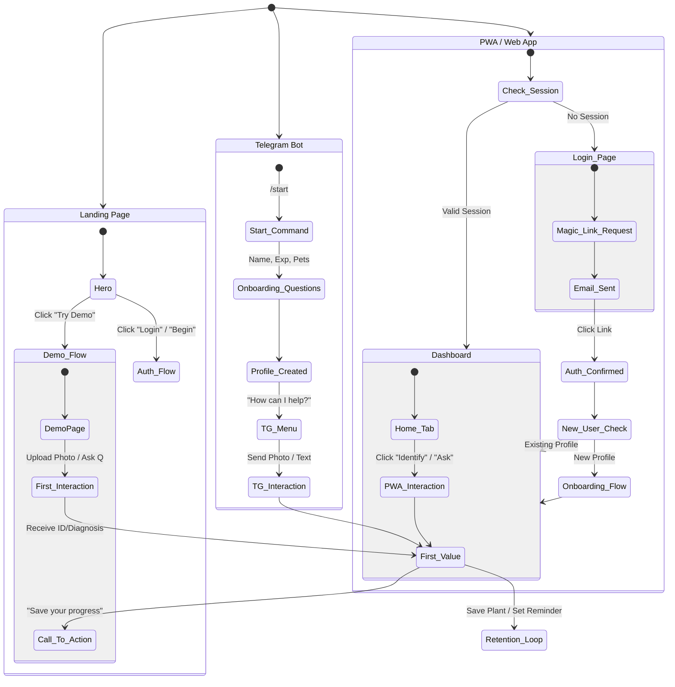
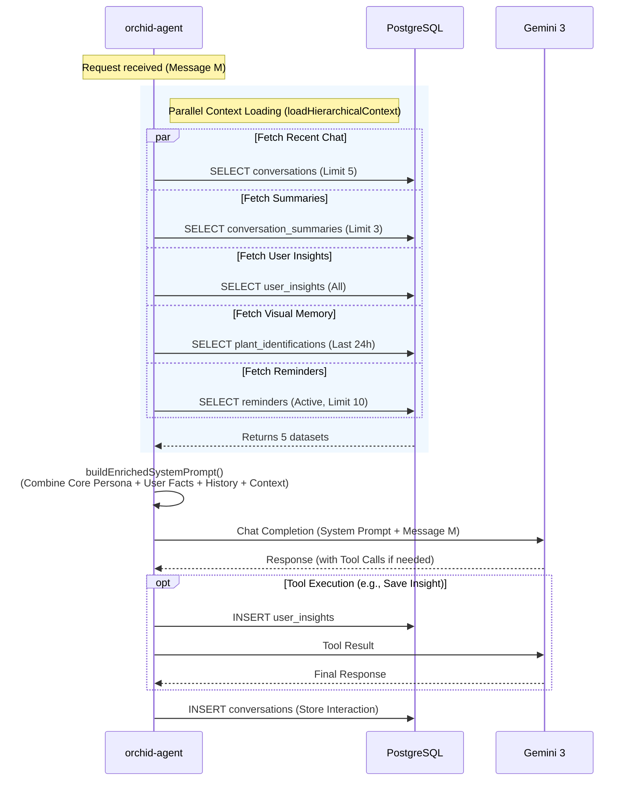
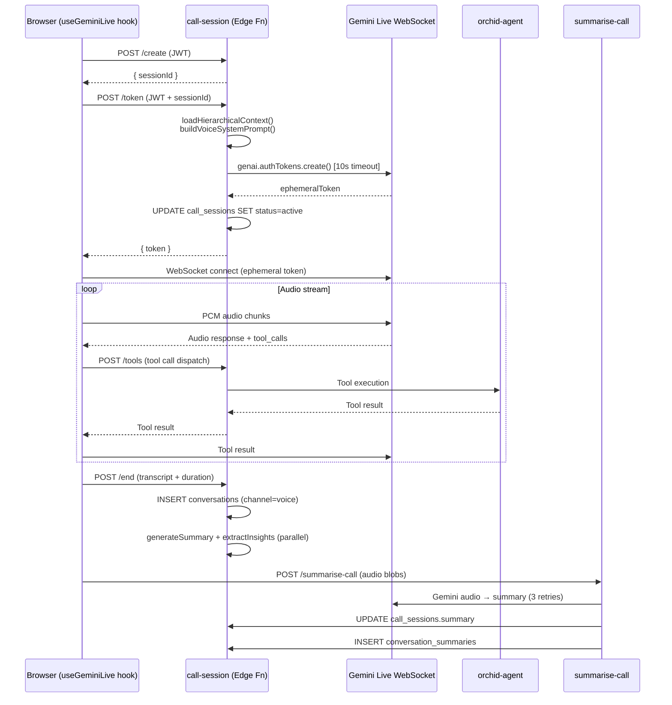
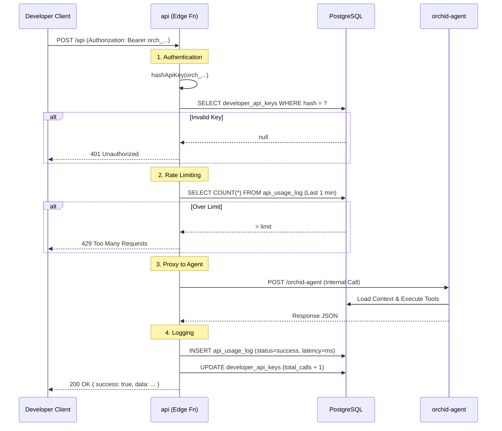

# Orchid — Technical Diagrams Collection

This document contains a collection of Mermaid and ASCII diagrams illustrating critical architectural flows, data models, and user journeys within the Orchid application.

## 1. User Journey (Entry to First Value)

This diagram illustrates the multiple entry points into the Orchid ecosystem and the path a user takes to reach their "first value" — typically a successful plant identification, diagnosis, or care advice.



## 2. Data Flow Architecture

This high-level diagram shows how data moves between the client interfaces, the Supabase backend (Edge Functions + Database), and the external AI services.

```mermaid
flowchart TD
    subgraph Clients ["Client Layer"]
        TG[Telegram Bot]
        PWA[PWA / Web App]
        Voice[Voice Call UI]
        Dev[External Developer]
    end

    subgraph Edge ["Supabase Edge Layer"]
        TB_Fn[telegram-bot]
        PA_Fn[pwa-agent]
        CS_Fn[call-session]
        API_Fn[api (REST)]
        OA_Fn[orchid-agent (Core Logic)]
    end

    subgraph Data ["Data Layer (PostgreSQL)"]
        Profiles[(profiles)]
        Plants[(plants)]
        History[(conversations)]
        Memory[(user_insights)]
        Vector[(plant_identifications)]
    end

    subgraph AI ["AI Services Layer"]
        Gateway[Lovable AI Gateway]
        Gemini[Google Gemini 3 Flash/Pro]
        Live[Gemini Live API (WebSocket)]
        Sonar[Perplexity Sonar]
    end

    %% Client -> Edge
    TG -->|Webhook| TB_Fn
    PWA -->|HTTPS| PA_Fn
    Dev -->|HTTPS + Key| API_Fn
    Voice -->|WebSocket| Live
    Voice -->|HTTPS| CS_Fn

    %% Edge -> Core
    TB_Fn -->|Internal Call| OA_Fn
    PA_Fn -->|Internal Call| OA_Fn
    API_Fn -->|Internal Call| OA_Fn
    CS_Fn -->|Tool Execution| OA_Fn

    %% Core -> Data
    OA_Fn -->|Read Context| Profiles & Plants & History & Memory & Vector
    OA_Fn -->|Write| History & Memory & Plants

    %% Core -> AI
    OA_Fn -->|Chat Completion| Gateway
    Gateway --> Gemini
    OA_Fn -->|Research| Sonar

    %% Live Voice Special Path
    Live <-->|Audio Stream| Voice
    Live -->|Tool Call| CS_Fn
```

## 3. Semantic & Visual Memory Architecture

### 3.1 Hierarchical Memory Layers (ASCII)

Orchid uses a tiered memory system to balance context window usage with long-term recall.

```ascii
┌─────────────────────────────────────────────────────────────────────┐
│  TIER 1: Immediate Context (last 5 messages)                         │
│  conversations ← most recent 5 rows, DESC order                     │
│  "What did you just say?"                                           │
├─────────────────────────────────────────────────────────────────────┤
│  TIER 2: Compressed History (last 3 summaries)                       │
│  conversation_summaries ← up to 3, ordered by end_time DESC         │
│  "What did we talk about last week?"                                │
├─────────────────────────────────────────────────────────────────────┤
│  TIER 3: Semantic Facts (User Insights)                              │
│  user_insights ← all rows for profileId                             │
│  "I have a cat", "I live in a dry climate", "I prefer brief answers"│
├─────────────────────────────────────────────────────────────────────┤
│  TIER 4: Visual Memory (Recent Identifications)                      │
│  plant_identifications ← last 5, created within 24h                 │
│  "This is the Monstera I showed you earlier today"                  │
├─────────────────────────────────────────────────────────────────────┤
│  TIER 5: Care Schedule (Active Reminders)                            │
│  reminders ← active only, ordered by next_due ASC, limit 10         │
│  "What do I need to water today?"                                   │
└─────────────────────────────────────────────────────────────────────┘
```

### 3.2 Memory Retrieval Sequence

This sequence details how the `orchid-agent` rebuilds context for every turn.



## 4. Live Call Architecture

### 4.1 Audio/Video Pipeline (ASCII)

The live call system bypasses the standard HTTP request/response cycle, establishing a direct WebSocket connection between the client browser and Google's Gemini Live API, with the Supabase Edge Function acting only as an authenticator and tool execution proxy.

```ascii
[ User Environment ]                   [ Supabase Edge ]                [ Google Cloud ]

   Microphone                                                          Gemini Live API
       │                                                                  (Server)
       ▼                                                                     ▲
[ Web Audio API ]                                                            │
(16kHz PCM Node) ──────────────────► [ WebSocket ] ──────────────────────► [ Model ]
       │                             (Client Side)                           │
       │                                   ▲                                 │
       │                                   │                                 │
   [ Speaker ] ◄───────────────────────────┘                                 │
(24kHz PCM Player)                                                           │
                                                                             │
   [ Camera ]                                                                │
       │                                                                     │
       ▼                                                                     │
 [ Video Element ] ──► [ Canvas ] ──► [ Base64 JPEG ] ───────────────────────┘
                                           ▲
                                           │
                                    (Tool Execution)
                                           │
                                           ▼
                                    [ call-session ] ◄───► [ Database ]
                                    (Edge Function)
```

### 4.2 Call Lifecycle Sequence



## 5. REST API Flow

This diagram illustrates how third-party developers interact with the Orchid platform via the public REST API.


