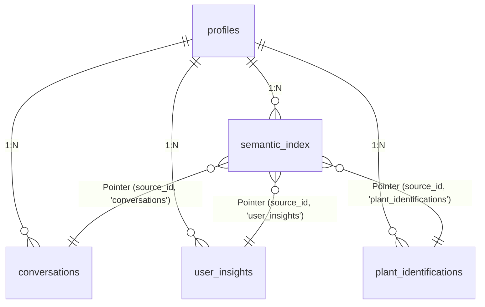
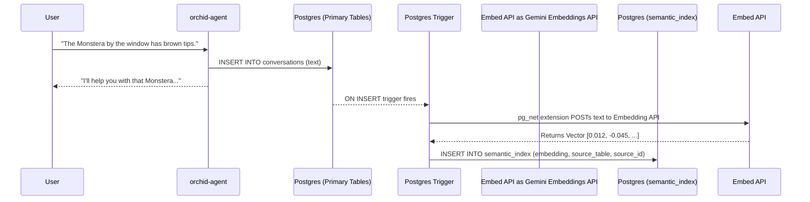
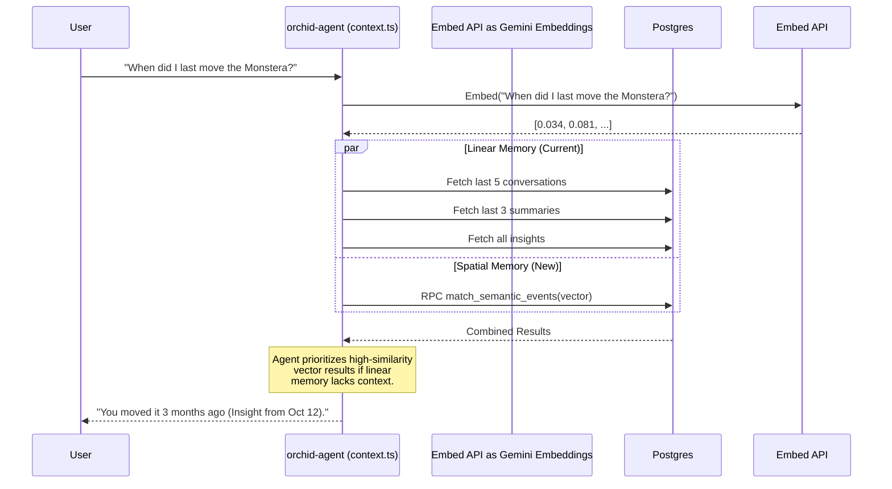

# Implementing pgvector for Spatial Memory (Orchid 2100)

The goal is to transition from Orchid's rigid, 5-tier chronological memory (Conversations, Summaries, Insights, Plant IDs, Reminders) to a **Semantic Vector Space** using Supabase `pgvector`.

### The Single-Index Constraint
Why not just add a `vector` column to the existing 5 tables?
Because approximate nearest neighbor (ANN) searches require traversing an HNSW index. An index **cannot span multiple tables**. If we had 5 tables, we would have to perform 5 separate vector searches on every chat message, which would destroy the current <4s p95 latency.

To solve this without duplicating data and creating a maintenance nightmare, we use a **Polymorphic Vector Index** alongside **Native Postgres Triggers**.

---

## 1. The Polymorphic Schema: `semantic_index`

Instead of duplicating the `content` of a conversation or insight, we introduce a single table (`semantic_index`) that stores *only* the vector embedding and a pointer back to the original row.

This acts as a high-speed search index, not a data store.

```sql
-- Enable the extension in Supabase
CREATE EXTENSION IF NOT EXISTS vector;

-- The unified vector index
CREATE TABLE semantic_index (
  id UUID PRIMARY KEY DEFAULT gen_random_uuid(),
  profile_id UUID REFERENCES profiles(id) ON DELETE CASCADE,

  -- The embedding (using OpenAI text-embedding-3-small or Google text-embedding-004: 1536 dims)
  embedding VECTOR(1536) NOT NULL,

  -- Polymorphic pointer: which table and which row does this vector represent?
  source_table VARCHAR(50) NOT NULL, -- e.g., 'conversations', 'user_insights'
  source_id UUID NOT NULL,

  created_at TIMESTAMPTZ DEFAULT NOW()
);

-- Create a single HNSW index for lightning-fast approximate nearest neighbor (ANN) search
CREATE INDEX ON semantic_index USING hnsw (embedding vector_cosine_ops);
```

### Schema Relationship Diagram



---

## 2. Zero-Maintenance Ingestion (Database Triggers + Edge Function)

You pointed out redundancy and maintenance overhead. To completely eliminate the need for the application (`orchid-agent`) to manage this, we push the responsibility to the database layer.

When a row is inserted or updated in `conversations`, a native Postgres trigger fires. This trigger calls a Supabase Edge Function to fetch the embedding, which then writes directly to `semantic_index`.

**If a row in `conversations` is deleted, `ON DELETE CASCADE` or a trigger automatically deletes the pointer in `semantic_index`. Zero drift.**

### Data Flow: Ingestion (Application is Unaware)



---

## 3. Augmented Retrieval (The Hybrid Search)

Currently, `_shared/context.ts` fires 5 parallel queries to load the last N items from each table chronologically.

We will add a **6th parallel query**: a single similarity search against `semantic_index`.

When the database finds the nearest vectors, it uses the `source_table` and `source_id` pointers to `JOIN` back to the original tables and fetch the text in milliseconds.

### Creating the Unified Matching Function
We need a Postgres function to perform the search and join:

```sql
CREATE OR REPLACE FUNCTION match_semantic_events (
  query_embedding vector(1536),
  match_threshold float,
  match_count int,
  p_profile_id uuid
)
RETURNS TABLE (
  source_table varchar,
  source_id uuid,
  content text,
  similarity float
)
LANGUAGE sql STABLE
AS $$
  WITH closest_matches AS (
    SELECT
      source_table,
      source_id,
      1 - (embedding <=> query_embedding) AS similarity
    FROM semantic_index
    WHERE profile_id = p_profile_id
      AND 1 - (embedding <=> query_embedding) > match_threshold
    ORDER BY embedding <=> query_embedding
    LIMIT match_count
  )
  -- Dynamically join back to the original tables to fetch the actual text
  SELECT
    cm.source_table,
    cm.source_id,
    COALESCE(
      c.text_content,
      u.insight_text,
      p.notes
    ) as content,
    cm.similarity
  FROM closest_matches cm
  LEFT JOIN conversations c ON cm.source_table = 'conversations' AND cm.source_id = c.id
  LEFT JOIN user_insights u ON cm.source_table = 'user_insights' AND cm.source_id = u.id
  LEFT JOIN plant_identifications p ON cm.source_table = 'plant_identifications' AND cm.source_id = p.id;
$$;
```

### Data Flow: Retrieval



---

## 4. Why this is "2100"

1. **Defeats the Time Boundary:** If a user mentioned moving their plant 6 conversations ago, it falls out of the "Immediate Context" (last 5 messages) and relies on the LLM's summarized history. With vectors, the exact quote from 6 months ago instantly snaps to the top of the context window because it is *semantically identical* to the question.
2. **Cross-Pollination of Modalities:** A `plant_identification` event (a photo) and a `user_insight` (text) live in different tables. In the vector space, they are mapped to the same coordinate area if they discuss the same plant, allowing the LLM to instantly link a visual diagnosis from Tuesday with a text complaint from Friday.
3. **Zero Maintenance:** Because the `semantic_index` is purely a pointer table managed entirely by database triggers, the application code (`orchid-agent`) requires zero logic to maintain it. It simply queries `match_semantic_events`.
