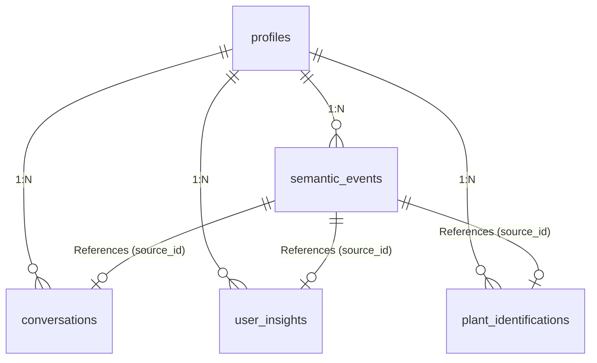
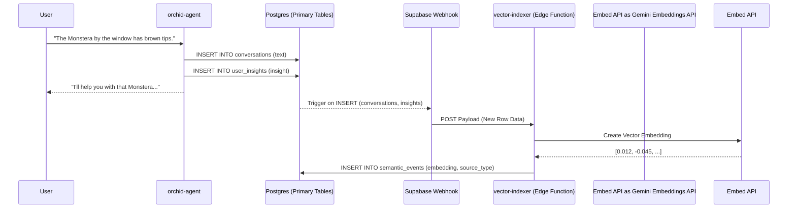
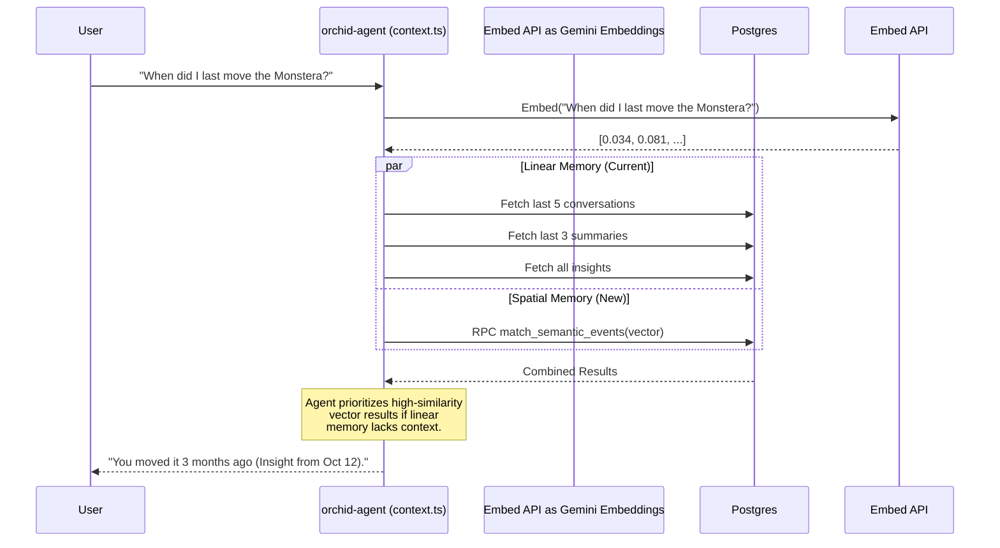

# Implementing pgvector for Spatial Memory (Orchid 2100)

The goal is to transition from Orchid's rigid, 5-tier chronological memory (Conversations, Summaries, Insights, Plant IDs, Reminders) to a **Semantic Vector Space** using Supabase `pgvector`.

Crucially, this transition must be **100% additive**. We will not replace the existing 5-tier query system; we will build a "Shadow Index" alongside it. Once the vector index proves reliable, we can use it to *augment* the existing context, rather than replace it.

---

## 1. The Additive Schema: `semantic_events`

Instead of altering `conversations` or `user_insights`, we introduce a new unifying table called `semantic_events`. This table acts as a read-only projection of all other tables, embedded as vectors.

```sql
-- Enable the extension in Supabase
CREATE EXTENSION IF NOT EXISTS vector;

-- The unified shadow table
CREATE TABLE semantic_events (
  id UUID PRIMARY KEY DEFAULT gen_random_uuid(),
  profile_id UUID REFERENCES profiles(id) ON DELETE CASCADE,

  -- The source of the memory (e.g., 'conversation', 'insight', 'plant_id', 'reminder')
  source_type VARCHAR(50) NOT NULL,

  -- The UUID of the original row in its respective table
  source_id UUID NOT NULL,

  -- The raw text representation of the event
  content TEXT NOT NULL,

  -- The embedding (using OpenAI text-embedding-3-small or Google text-embedding-004: 1536 dims)
  embedding VECTOR(1536),

  -- Contextual metadata (e.g., {"plant_id": "...", "sentiment": "negative"})
  metadata JSONB DEFAULT '{}'::jsonb,

  created_at TIMESTAMPTZ DEFAULT NOW()
);

-- Create an HNSW index for lightning-fast approximate nearest neighbor (ANN) search
CREATE INDEX ON semantic_events USING hnsw (embedding vector_cosine_ops);
```

### Schema Relationship Diagram



---

## 2. Asynchronous Ingestion (The "Shadow" Writer)

We cannot slow down the primary chat latency (currently <4s p95 text, <6s p95 vision) by forcing the agent to compute and store embeddings during the critical path.

Instead, we use **Supabase Database Webhooks** to trigger a lightweight background Edge Function (`vector-indexer`) whenever a new memory is created in the primary tables.

### Data Flow: Ingestion



**Why this works:** The core app doesn't even know `pgvector` exists yet. If the `vector-indexer` function fails, the user still gets their chat response, and the 5-tier memory still works perfectly.

---

## 3. Augmented Retrieval (The Hybrid Search)

Currently, `_shared/context.ts` fires 5 parallel queries to load the last N items from each table chronologically.

We will add a **6th parallel query**: a similarity search against `semantic_events`.

When a user asks a question, we embed their prompt and query the database for the *nearest neighbors* regardless of chronological age.

### Creating the Matching Function
We need a Postgres function to perform the cosine similarity search:

```sql
CREATE OR REPLACE FUNCTION match_semantic_events (
  query_embedding vector(1536),
  match_threshold float,
  match_count int,
  p_profile_id uuid
)
RETURNS TABLE (
  id uuid,
  content text,
  source_type varchar,
  metadata jsonb,
  similarity float
)
LANGUAGE sql STABLE
AS $$
  SELECT
    id,
    content,
    source_type,
    metadata,
    1 - (embedding <=> query_embedding) AS similarity
  FROM semantic_events
  WHERE 1 - (embedding <=> query_embedding) > match_threshold
    AND profile_id = p_profile_id
  ORDER BY embedding <=> query_embedding
  LIMIT match_count;
$$;
```

### Data Flow: Retrieval



---

## 4. Why this is "2100"

1. **Defeats the Time Boundary:** Currently, if a user mentioned moving their plant 6 conversations ago, it falls out of the "Immediate Context" (last 5 messages) and relies on the LLM's summarized history. With vectors, the exact quote from 6 months ago instantly snaps to the top of the context window because it is *semantically identical* to the question.
2. **Cross-Pollination of Modalities:** A `plant_identification` event (a photo) and a `user_insight` (text) live in different tables. In the vector space, they are mapped to the same coordinate area if they discuss the same plant, allowing the LLM to instantly link a visual diagnosis from Tuesday with a text complaint from Friday.
3. **Zero Risk:** Because it runs in parallel (`Promise.all` in `context.ts`), if the vector search times out or errors, we simply catch the error and fallback to the existing 5-tier context array. The user experience is never degraded.
