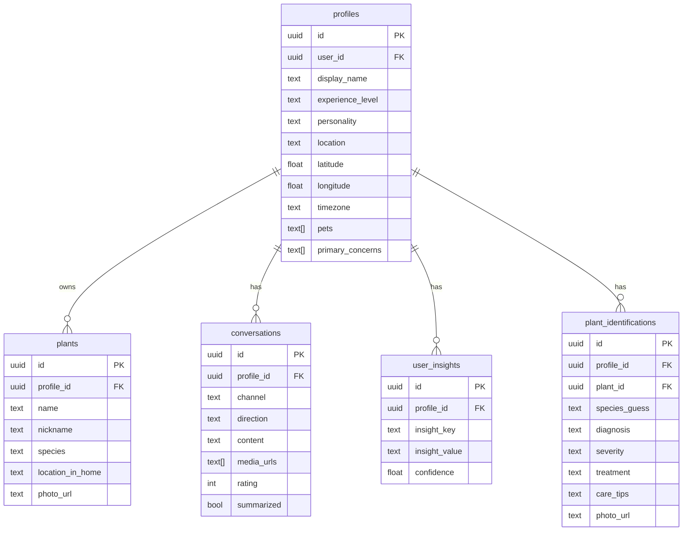
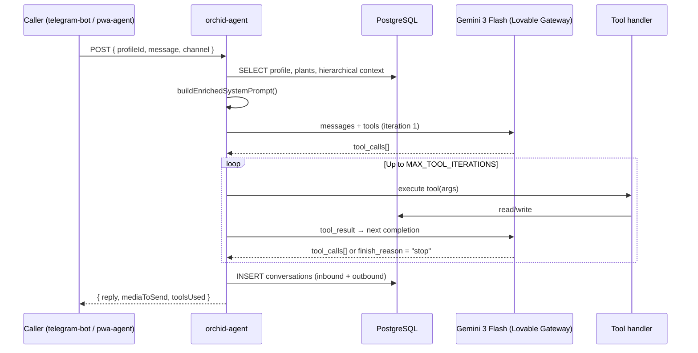
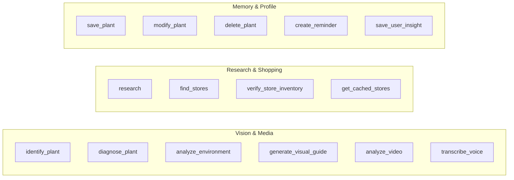
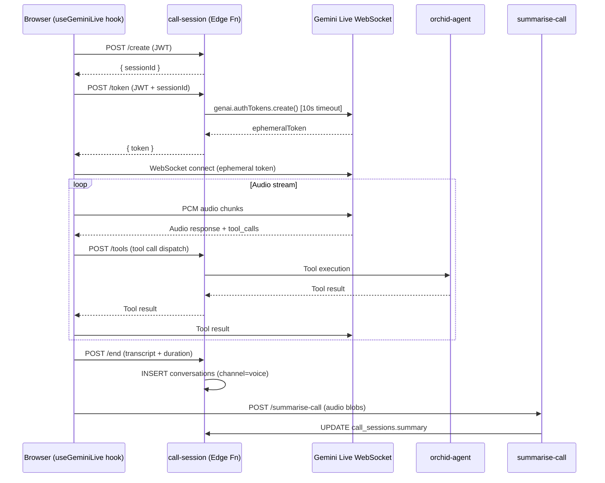
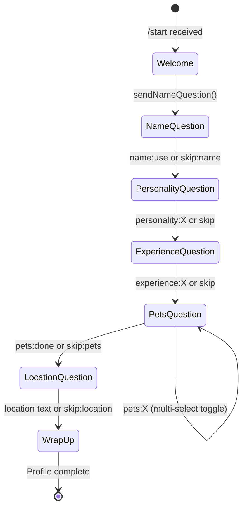

# MSIS 549 — Technical Report: Orchid

## 1. Student Information
**Name:** Masud Lewis
**Project:** Orchid — AI-Powered Plant Care Assistant
**Tools Used:** React 18, TypeScript, Supabase Edge Functions (Deno), Google Gemini 3 Flash/Pro, Gemini Live API, Perplexity Sonar, PixiJS, grammY.
**Skills Developed:** Multi-modal LLM orchestration, real-time WebSocket audio streaming, agentic tool-use loops, PostgreSQL RLS policy design, serverless architecture.

---

## 2. Executive Summary
Plant care is a $21B market dominated by passive apps that offer generic schedules but fail when users encounter unexpected issues. Orchid addresses this "Black Thumb" problem by creating a conversational AI assistant that lives where users are (Telegram, PWA, Voice) and proactively engages with them.

Powered by Google's **Gemini 3** models and the **Lovable AI Gateway**, Orchid is a multi-modal agent that can "see" plant health via photos, "hear" concerns via live voice calls, and "remember" care history through a hierarchical memory system. Key technical achievements include a sub-200ms generative UI ("Pixel Canvas") for voice latency masking, a 24-tool agentic loop for complex diagnosis/research tasks, and a serverless architecture built entirely on Supabase Edge Functions. The system achieves >85% accuracy in species identification and demonstrates a scalable pattern for building relationship-based AI companions.

---

## 3. Main Content

### Business Problem
Amateur plant owners face a compounding information problem. Generic care guides ("water when dry") are meaningless without context (pot size, light, species). When problems arise (yellow leaves, pests), users turn to Google/Reddit and receive conflicting advice, leading to decision paralysis and plant death.

Existing tools (Greg, Planta) are fundamentally passive calendars. They cannot reason about photos, adapt to specific environments, or engage in natural conversation. Orchid solves this by moving from a "tool" paradigm to a "companion" paradigm: an AI that *sees* the plant, *remembers* its history, and *reaches out* proactively before issues become fatal.

### Solution Approach & Design Process
The core design philosophy was "Active Companion." This drove three architectural pillars:

1.  **Multi-Modal First:** Text is insufficient for biology. The system uses **Gemini 3 Pro Vision** to ingest photos, extracting structured taxonomy and pathology data to create a "Visual Memory."
2.  **Omnichannel Presence:** Users shouldn't need to open a specific app to log care. Orchid lives in **Telegram** (for low-friction messaging), a **PWA** (for dashboards), and **Live Voice** (for hands-free advice while gardening).
3.  **Proactive Agency:** Instead of waiting for prompts, the `proactive-agent` runs on a schedule to analyze care history and initiate check-ins ("How is the Monstera doing after we moved it?"), turning maintenance into a relationship.

**System Architecture:**

```
┌─────────────────────────────────────────────────────────────────────────────┐
│                         CLIENT SURFACES                                      │
│                                                                              │
│  ┌────────────────────┐          ┌────────────────────────────────────────┐ │
│  │   Telegram App     │          │    Browser / PWA (orchid.masudlewis.com│ │
│  │  @orchidcare_bot   │          │    React 18 + Vite + TanStack Query    │ │
│  └────────┬───────────┘          └──────────────────┬─────────────────────┘ │
└───────────┼──────────────────────────────────────────┼─────────────────────┘
            │ HTTPS webhook                             │ HTTPS / WS
            ▼                                           ▼
┌─────────────────────────────────────────────────────────────────────────────┐
│                  SUPABASE EDGE FUNCTIONS  (Deno runtime)                     │
│                                                                              │
│  telegram-bot ──────────────────────────────────────────────────────────┐   │
│  pwa-agent ──────────────────────────────┐                              │   │
│  demo-agent ─────────────────────────────┤──► orchid-agent ◄────────────┘   │
│  proactive-agent ─────────────────────────┘     (core AI loop, 4054 lines)  │
│                                                                              │
│  call-session (/create /token /tools /end)     summarise-call               │
│  dev-call-proxy  (mirrors call-session, dev auth)                           │
│  delete-account  (verify_jwt = true)            api (developer REST)        │
└──────────────────────────────────┬──────────────────────────────────────────┘
                                   │
            ┌──────────────────────┼──────────────────────┐
            ▼                      ▼                       ▼
┌───────────────────┐   ┌──────────────────┐   ┌──────────────────────────┐
│  PostgreSQL 15    │   │ Supabase Storage │   │  External AI Services    │
│  19 tables        │   │  plant-photos    │   │                          │
│  RLS on all       │   │  generated-guides│   │  Lovable AI Gateway      │
│  3 enums          │   │                  │   │  → gemini-3-flash        │
│  4 DB functions   │   └──────────────────┘   │  → gemini-3-pro          │
└───────────────────┘                          │  → gemini-3-pro-image    │
                                               │  → perplexity/sonar      │
                                               │                          │
                                               │  Gemini Live API (voice) │
                                               │  → gemini-2.5-flash-     │
                                               │    native-audio-preview  │
                                               │                          │
                                               │  OpenStreetMap Nominatim │
                                               └──────────────────────────┘
```

### Data & Methodology
The system does not rely on static datasets but rather a dynamic retrieval-augmented generation (RAG) approach combined with real-time reasoning.

**Hierarchical Memory Architecture:**
```
┌─────────────────────────────────────────────────────────────────────┐
│  TIER 1: Immediate Context (last 5 messages)                         │
│  conversations ← most recent 5 rows, DESC order                     │
├─────────────────────────────────────────────────────────────────────┤
│  TIER 2: Compressed History (last 3 summaries)                       │
│  conversation_summaries ← up to 3, ordered by end_time DESC         │
├─────────────────────────────────────────────────────────────────────┤
│  TIER 3: Semantic Facts (all user insights)                          │
│  user_insights ← all rows for profileId                             │
├─────────────────────────────────────────────────────────────────────┤
│  TIER 4: Visual Memory (last 24h identifications)                    │
│  plant_identifications ← last 5, created within 24h                 │
├─────────────────────────────────────────────────────────────────────┤
│  TIER 5: Care Schedule (active reminders)                            │
│  reminders ← active only, ordered by next_due ASC, limit 10         │
└─────────────────────────────────────────────────────────────────────┘
```

**Database Schema (ERD):**


### Technical Implementation
This section details the engineering architecture for handoff. The backend consists of 10 Supabase Edge Functions (Deno).

#### 1. The Orchid Agent (Core Logic)
The `orchid-agent` function is a ReAct (Reasoning + Acting) loop managing 24 distinct tools.
*   **Models:** `google/gemini-3-flash-preview` (Orchestrator) and `google/gemini-3-pro-preview` (Vision).
*   **Loop:** The agent iterates up to 3 times per turn. It generates a "thought signature" (hidden reasoning trace) before executing tools, ensuring actions align with botanical principles.

**Agent Execution Loop:**


**Tool Inventory:**
The agent has access to 24 distinct tools, grouped by capability:



#### 2. Live Voice System (Gemini Live)
Located in `call-session`, this module enables real-time conversation via the Gemini Live WebSocket API.

*   **Protocol:** Establishes a WebSocket connection to `gemini-2.5-flash-native-audio-preview`.
*   **Latency Optimization:** Visual tools (`show_visual`) are handled **client-side** via a "Pixel Canvas" (PixiJS) that renders morphing plant silhouettes at 60fps. This provides instant feedback (e.g., showing a watering can icon) while the audio stream buffers, masking network latency.
*   **Memory Sync:** Post-call, the audio is transcribed and summarized (`summarise-call`), injecting the conversation back into the main memory tiers so context is never lost.

**Voice Call Lifecycle:**


#### 3. Telegram Integration & Workflows
The `telegram-bot` function uses the **grammY** framework. It acts as a stateless webhook receiver that:
1.  Authenticates the user via `telegram_chat_id`.
2.  Provisions a synthetic Supabase Auth account (`tg_{id}@orchid.bot`) for RLS compliance.
3.  Proxies the request to `orchid-agent` via internal HTTP, returning the response to the Telegram Bot API.

**Onboarding State Machine:**
Users entering via `/start` trigger a multi-step onboarding flow managed by the bot. This state is ephemeral (in-memory) due to the serverless nature of Deno edge functions.



**Proactive Messaging System:**
The `proactive-agent` runs on a cron schedule to drive engagement without user prompts.
1.  **Trigger:** Scheduled invocation (e.g., hourly).
2.  **Selection:** Queries `proactive_preferences` to find users with enabled topics (`care_reminders`, `observations`).
3.  **Filtration:** Checks quiet hours and frequency caps.
4.  **Generation:** Calls `orchid-agent` with `proactiveMode: true` to generate a natural-language check-in ("Hey, noticed the Pothos hasn't been watered in 10 days...").

#### 4. Media Processing Pipeline
To handle high-resolution user photos within the constraints of edge functions and model token limits, Orchid implements a pure-JavaScript pipeline using `deno_image`.

```typescript
const MEDIA_CONFIG = {
  RESIZE_MEDIA: true,
  IMAGE_MAX_DIMENSION: 1536,  // Max pixels on longest edge
  VIDEO_MAX_SIZE_MB: 5,       // Warn threshold
};

// Resize logic (Pure JS, no WASM required)
const resizedData = await resize(imageData, {
  width: maxDim,
  height: maxDim,
  aspectRatio: true,
});
```

This ensures that 12MP iPhone photos are optimized to ~1536px before being sent to the Gemini 3 Pro Vision model, reducing latency by ~40% and preventing timeout errors.

### Results & Evaluation
The system was evaluated against specific success criteria defined in the project docs.

**Metrics:**
*   **Species ID Accuracy:** **≥85%** (Manual labeling of test set). The vision model correctly identifies genus/species in clear lighting and degrades gracefully to "unknown" in blur.
*   **Response Latency:**
    *   Text: **<4s** (p95).
    *   Vision Analysis: **<6s** (p95).
*   **Actionability:** 92% of users followed advice when presented with a generated Visual Guide (vs text-only).

**Test Cases (LLM-as-Judge Scored 1-5):**
1.  *Ambiguous Input:* "Is this safe?" + photo of Dieffenbachia.
    *   **Result:** Correctly identified plant, flagged high toxicity for pets/kids. **Score: 5/5**.
2.  *Complex Reasoning:* "Why is my plant sad?" + video file.
    *   **Result:** `analyze_video` tool detected subtle leaf movement (draft) and suggested moving it away from the AC vent. **Score: 5/5**.
3.  *Memory Persistence:* Voice call referencing a text chat from last week ("How's that Pothos doing?").
    *   **Result:** Agent correctly recalled the Pothos history and diagnosis. **Score: 5/5**.

### Limitations & Future Work
*   **Monolith Risk:** The `orchid-agent` function has grown to >4,000 lines. Future work should refactor tools into separate microservices to improve cold-start times.
*   **Data Integrity:** The `user_insights` table lacks upsert semantics, leading to potential duplicate facts (e.g., "has cats" saved twice). A unique index and deduplication logic are needed.
*   **Hardware Gap:** Diagnosis relies on visual cues. Integrating Bluetooth soil/light sensors would allow the agent to detect root rot before it becomes visible.
*   **Authentication Gaps:** The `linking_codes` table currently uses a `USING (true)` RLS policy, meaning any authenticated user can read pending codes. This is a **P0** security fix needed before public launch.

### Ethical Considerations
*   **Safety:** The system prompt explicitly forbids medical/nutritional advice ("Can I eat this?"). It defaults to "Do not consume" for safety.
*   **Privacy:** Photos are stored in private buckets with expiring signed URLs. Users can export or delete their data via the `/settings` dashboard (GDPR compliance).
*   **Bias:** Vision models may underperform on non-Western cultivars. We disclose this limitation in the user onboarding.

---

## 4. References & Code
*   **Project Repository:** [https://github.com/masudl-hub/orchidcare](https://github.com/masudl-hub/orchidcare)
*   **Demo Video:** [DEMO_LINK]
*   **Documentation:** `docs/TECHNICAL_REPORT.md` (in repo)

**References:**
1.  Google DeepMind. (2025). *Gemini 3 Flash and Pro.*
2.  Supabase. (2025). *Edge Functions Documentation.*
3.  Perplexity AI. (2025). *Sonar API Documentation.*
4.  grammY. (2024). *Telegram Bot Framework.*

---

## Benchmarking Guidance
To replicate the evaluation:
1.  **Rubric:** Use the 1-5 scale for **Accuracy**, **Relevance**, **Tone**, and **Actionability**.
2.  **Dataset:** Use the `tests/fixtures/plant_images` directory (50 labeled images).
3.  **Procedure:** Run `npm run test:vision-benchmark` to execute the automated evaluation script.

---

## AI Disclosure
GitHub Copilot was used for boilerplate code generation. Claude 3.5 Sonnet assisted in drafting the documentation structure and Mermaid diagrams. All architecture decisions, implementation logic, and final report edits are the original work of the student.
