# Orchid — Technical Report

**Project:** Orchid — AI-Powered Plant Care Assistant
**Author:** Masud Lewis
**Production URL:** https://orchid.masudlewis.com
**Repository:** https://github.com/masudl-hub/orchidcare
**Demo Video:** *(link here)*
**Report Date:** February 2026

---

## Table of Contents

1. [Student Information](#1-student-information)
2. [Executive Summary](#2-executive-summary)
3. [Business Problem & Motivation](#3-business-problem--motivation)
4. [System Architecture Overview](#4-system-architecture-overview)
5. [AI Agent — Orchid](#5-ai-agent--orchid)
6. [Telegram Channel Integration](#6-telegram-channel-integration)
7. [Real-Time Voice Call System](#7-real-time-voice-call-system)
8. [Progressive Web App (PWA)](#8-progressive-web-app-pwa)
9. [Data Layer & Database Models](#9-data-layer--database-models)
10. [Authentication & Security](#10-authentication--security)
11. [Memory & Context Engineering](#11-memory--context-engineering)
12. [Developer Platform & REST API](#12-developer-platform--rest-api)
13. [Results & Evaluation](#13-results--evaluation)
14. [Limitations, Future Work & Ethics](#14-limitations-future-work--ethics)
15. [References & AI Disclosure](#15-references--ai-disclosure)

---

## 1. Student Information

**Name:** Masud Lewis

### What I Built

Orchid is a conversational AI plant care assistant that lives wherever users already spend their time — Telegram, a browser-installed PWA, or a live voice call. Users send a photo of a struggling plant and receive an instant species identification, health diagnosis, and care plan. They can save plants to a persistent collection, set watering reminders, and receive proactive check-ins based on real care schedules. The assistant remembers everything across all channels: a conversation started on Telegram continues seamlessly in the PWA or voice.

### Tools & Technologies

| Layer | Technology |
|---|---|
| Frontend | React 18, TypeScript, Vite, TanStack Query, shadcn/ui, Tailwind CSS |
| PWA | vite-plugin-pwa, Workbox, Web App Manifest |
| Messaging | grammY 1.21 (Telegram Bot API), NDJSON streaming |
| Voice | Google GenAI SDK (`@google/genai`), Gemini Live WebSocket, PixiJS |
| Backend | Supabase Edge Functions (Deno runtime), PostgreSQL 15 |
| AI Models | Gemini 3 Flash, Gemini 3 Pro, Gemini 2.5 Flash Native Audio, Perplexity Sonar |
| AI Gateway | Lovable AI Gateway (OpenAI-compatible endpoint) |
| Database | Supabase Postgres with Row-Level Security |
| Storage | Supabase Storage (`plant-photos`, `generated-guides`) |
| Auth | Supabase Auth (JWT), Telegram HMAC-SHA256, Developer SHA-256 API keys |
| Deployment | Lovable Cloud (Supabase + Vite SPA) |

### Skills Developed

Through this project I developed production-grade skills in: multi-modal LLM integration (text, image, audio), agentic tool-calling loop design, multi-channel bot architecture, real-time WebSocket audio streaming, ephemeral token authentication flows, PostgreSQL RLS policy design, and technical documentation for engineering handoffs.

---

## 2. Executive Summary

Plant care is a $21B market dominated by passive apps that show generic watering schedules. These tools fail the moment a user encounters an unexpected yellow leaf, an unidentified specimen, or a care question that depends on their specific environment. The result is plant anxiety and preventable plant death.

Orchid solves this with a conversational AI assistant — the same name whether accessed through Telegram, a PWA, or a live voice call. The assistant is powered by a multi-modal Gemini 3 architecture routed through the Lovable AI Gateway, enriched with Perplexity Sonar for real-time research, and backed by a hierarchical memory system that spans a PostgreSQL database. The system is built on ten Supabase Edge Functions running Deno, making it serverless and zero-infrastructure to operate.

**Key results:** Species identification from photos in under 3 seconds; proactive care reminders delivered via Telegram on user-defined schedules; sub-200ms PWA response latency for text queries; live voice calls with real-time audio streaming and a post-call memory pipeline.

**Key limitations:** The orchid-agent edge function has grown to 4,000+ lines (monolith risk); the onboarding state in `telegram-bot` is in-memory (lost on cold start); SMS/WhatsApp integration is incomplete (columns exist, no live integration); several RLS policies have prototype-level gaps.

---

## 3. Business Problem & Motivation

### 3.1 The Problem

Amateur plant owners face a compounding information problem. Generic care guides give instructions like "water when the top inch of soil is dry," which is meaningless without knowing the pot size, soil mix, light exposure, seasonal context, and plant species. When something goes wrong — yellowing leaves, wilting, spots — the user turns to Google, Reddit, or YouTube and receives conflicting, context-free information. The result is decision paralysis and eventually plant death.

The status quo tools (Greg, Planta, Vera) are fundamentally passive: they deliver scheduled notifications but cannot engage with unexpected situations, learn from experience, or reason about photos. They are care calendar apps, not care assistants.

### 3.2 Target Users

- **Beginner plant owners** (first 1–3 years): high anxiety, unfamiliar with terminology, most likely to kill plants through ignorance. Highest motivation for improvement.
- **Intermediate collectors** (3–7 years): growing collections, complex care schedules, interested in advanced topics like propagation and diagnosis.

Both groups share one critical characteristic: they are already on Telegram or can install a PWA. Orchid's zero-install path is intentional — a Telegram bot requires no app store approval, no download, no account creation beyond what the user's phone number already provides.

### 3.3 Why Conversational AI, Why Now

Three factors align to make this feasible in 2025–2026:

1. **Gemini 3 Flash** provides cost-effective multimodal reasoning at sub-3-second latency for photo analysis, making vision-first interactions affordable at scale.
2. **Gemini Live API** enables native audio streaming with function-calling support, making voice calls with real tool execution (saving plants, setting reminders) possible without a transcript round-trip.
3. **Supabase Edge Functions + Lovable AI Gateway** eliminate infrastructure management overhead, allowing a solo developer to ship a multi-channel, multi-modal AI backend without DevOps investment.

### 3.4 Competitive Differentiation

| Feature | Greg | Planta | Orchid |
|---|---|---|---|
| Conversational AI | ✗ | ✗ | ✓ |
| Photo identification | ✓ | ✓ | ✓ |
| Telegram native | ✗ | ✗ | ✓ |
| Live voice call | ✗ | ✗ | ✓ |
| Cross-channel memory | ✗ | ✗ | ✓ |
| Proactive care | ✓ | ✓ | ✓ |
| Real-time research | ✗ | ✗ | ✓ (Perplexity) |
| Zero-install path | ✗ | ✗ | ✓ (Telegram) |

---

## 4. System Architecture Overview

### 4.1 Component Inventory

```
┌─────────────────────────────────────────────────────────────────────────────┐
│                         CLIENT SURFACES                                      │
│                                                                              │
│  ┌────────────────────┐          ┌────────────────────────────────────────┐ │
│  │   Telegram App     │          │    Browser / PWA (orchid.masudlewis.com│ │
│  │  @orchidcare_bot   │          │    React 18 + Vite + TanStack Query    │ │
│  └────────┬───────────┘          └──────────────────┬─────────────────────┘ │
└───────────┼──────────────────────────────────────────┼─────────────────────┘
            │ HTTPS webhook                             │ HTTPS / WS
            ▼                                           ▼
┌─────────────────────────────────────────────────────────────────────────────┐
│                  SUPABASE EDGE FUNCTIONS  (Deno runtime)                     │
│                                                                              │
│  telegram-bot ──────────────────────────────────────────────────────────┐   │
│  pwa-agent ──────────────────────────────┐                              │   │
│  demo-agent ─────────────────────────────┤──► orchid-agent ◄────────────┘   │
│  proactive-agent ─────────────────────────┘     (core AI loop, 4054 lines)  │
│                                                                              │
│  call-session (/create /token /tools /end)     summarise-call               │
│  dev-call-proxy  (mirrors call-session, dev auth)                           │
│  delete-account  (verify_jwt = true)            api (developer REST)        │
└──────────────────────────────────┬──────────────────────────────────────────┘
                                   │
            ┌──────────────────────┼──────────────────────┐
            ▼                      ▼                       ▼
┌───────────────────┐   ┌──────────────────┐   ┌──────────────────────────┐
│  PostgreSQL 15    │   │ Supabase Storage │   │  External AI Services    │
│  19 tables        │   │  plant-photos    │   │                          │
│  RLS on all       │   │  generated-guides│   │  Lovable AI Gateway      │
│  3 enums          │   │                  │   │  → gemini-3-flash        │
│  4 DB functions   │   └──────────────────┘   │  → gemini-3-pro          │
└───────────────────┘                          │  → gemini-3-pro-image    │
                                               │  → perplexity/sonar      │
                                               │                          │
                                               │  Gemini Live API (voice) │
                                               │  → gemini-2.5-flash-     │
                                               │    native-audio-preview  │
                                               │                          │
                                               │  OpenStreetMap Nominatim │
                                               └──────────────────────────┘
```

### 4.2 Supabase Configuration

```toml
project_id = "ewkfjmekrootyiijrgfh"

[functions.pwa-agent]
verify_jwt = false          # Auth handled in-function; JWT validation skipped

[functions.delete-account]
enabled = true
verify_jwt = true           # Delete requires valid Supabase JWT
```

All other edge functions accept requests without Supabase JWT enforcement — they perform their own authentication internally (Telegram HMAC, service_role guards, or `X-Internal-Agent-Call` header validation).

### 4.3 Request Lifecycle: Telegram Message


### 4.4 Request Lifecycle: PWA Chat Message


The `pwa-agent` wraps `orchid-agent` responses in NDJSON format, emitting tool-use events before the final reply so the UI can show live status ("identifying plant…", "researching…").

---

## 5. AI Agent — Orchid

### 5.1 Agent Identity

The agent's persona is defined in `supabase/functions/_shared/context.ts` as the `ORCHID_CORE` constant — a system prompt that establishes Orchid's worldview, communication principles, and hard constraints:

```typescript
const ORCHID_CORE = `You are Orchid.

WHAT YOU BELIEVE:
- Every plant person is already a plant person. The barrier isn't ability — it's
  information anxiety. You exist to close that gap.
- Memory is care. Remembering what a plant looked like last month, what the user
  tried, what worked — that's not a feature, it's how a friend shows up.
- Be goal-seeking, not answer-dispensing. When someone asks you something, pursue
  their actual intent until you have something genuinely useful. Never give a
  generic non-answer.

WHAT YOU NEVER DO:
- Never mention or reference the user's experience level. Use it silently.
- Never lecture. Never preamble. Get to the point.
- Never start with "Great question!" — just answer.`;
```

Four personality tones modify this core: `warm`, `expert`, `playful`, `philosophical`. The user selects their tone during onboarding and can change it at any time. The tone is stored in `profiles.personality` (a `doctor_personality` enum) and injected into the system prompt via `toneModifiers`.

### 5.2 Model Inventory

| Purpose | Model | Endpoint | thinking_config |
|---|---|---|---|
| Text orchestration (main loop) | `google/gemini-3-flash-preview` | Lovable AI Gateway | `{ thinking_level: "low" }` |
| Vision: identify / diagnose / environment | `google/gemini-3-pro-preview` (primary) | Lovable AI Gateway | `{ thinking_level: "low" }` |
| Vision fallback | `google/gemini-2.5-pro` | Lovable AI Gateway | — |
| Image generation (guides) | `google/gemini-3-pro-image-preview` | Lovable AI Gateway | — |
| Deep reasoning (deep_think tool) | `google/gemini-3-flash-preview` | Lovable AI Gateway | `{ thinking_level: "high" }` |
| Research | Perplexity Sonar | `api.perplexity.ai` | — |
| Research rewrite | `google/gemini-3-flash-preview` | Lovable AI Gateway | `{ thinking_level: "minimal" }` |
| Voice call | `models/gemini-2.5-flash-native-audio-preview-12-2025` | Gemini Live API | (not applicable) |
| Call summarisation | `gemini-3-flash-preview` | `@google/genai` SDK direct | — |

All non-voice model calls route through:
`https://ai.gateway.lovable.dev/v1/chat/completions`
authenticated with `LOVABLE_API_KEY`.

> **Note:** `summarise-call` uses the `@google/genai` SDK with direct `GEMINI_API_KEY` — it bypasses the Lovable gateway intentionally, as it processes raw audio blobs that the OpenAI-compat endpoint does not accept.

### 5.3 Tool Inventory (24 Tools)


| Tool | Capability Required | Description |
|---|---|---|
| `identify_plant` | (always allowed) | Vision species ID from photo |
| `diagnose_plant` | (always allowed) | Health diagnosis from photo |
| `analyze_environment` | (always allowed) | Analyze light/conditions from photo |
| `generate_visual_guide` | `generate_content` | Step-by-step illustrated care guide |
| `analyze_video` | (always allowed) | Process video file |
| `transcribe_voice` | (always allowed) | Transcribe audio file |
| `research` | (always allowed) | Perplexity Sonar web research |
| `find_stores` | (always allowed) | Local nursery/store search |
| `verify_store_inventory` | `shopping_search` | Confirm stock at specific store |
| `get_cached_stores` | (always allowed) | Retrieve prior store search results |
| `save_plant` | `manage_plants` | Create plant record in DB |
| `modify_plant` | `manage_plants` | Update plant fields (bulk supported) |
| `delete_plant` | `delete_plants` | Remove plant (bulk + confirmation) |
| `create_reminder` | `create_reminders` | Schedule care reminder |
| `delete_reminder` | `create_reminders` | Remove reminder |
| `log_care_event` | (always allowed) | Record watering/fertilising/etc. |
| `save_user_insight` | (always allowed) | Persist user fact to `user_insights` |
| `update_notification_preferences` | `create_reminders` | Toggle proactive topics |
| `update_profile` | (always allowed) | Update profile fields |
| `deep_think` | (always allowed) | High-thinking-budget reasoning step |
| `generate_image` | `generate_content` | Create a botanical illustration |
| `capture_plant_snapshot` | (always allowed) | Save visual snapshot with description |
| `compare_plant_snapshots` | (always allowed) | Show growth/change over time |
| `recall_media` | (always allowed) | Retrieve stored photos/guides |

Capability enforcement uses the `TOOL_CAPABILITY_MAP` from `_shared/tools.ts`:

```typescript
export const TOOL_CAPABILITY_MAP: Record<string, string> = {
  delete_plant: "delete_plants",
  create_reminder: "create_reminders",
  delete_reminder: "create_reminders",  // reuses same permission
  update_notification_preferences: "create_reminders",
};
```

Capabilities are checked against `agent_permissions` rows for the profile. If a capability is disabled, orchid-agent returns an error string pointing the user to settings.

> ⚠️ **Vestigial:** The error message in `orchid-agent/index.ts` line 2788 still references `viridisml.lovable.app/settings` — an old project URL. The correct URL should be `orchid.masudlewis.com/settings`.

### 5.4 Agent Loop (orchid-agent)


The loop iterates up to `MAX_TOOL_ITERATIONS` (configurable per channel). On each iteration, tool results are appended to the messages array and a new completion is requested. Gemini 3 Flash's `thoughtSignature` — a serialised reasoning context — is extracted from each response and re-sent on follow-up calls within the same turn to maintain strict function-calling coherence.

### 5.5 Media Processing Pipeline

Photos sent to Orchid are resized before being passed to the vision model. The pipeline uses `deno_image@0.0.4` — a pure JavaScript image resizer that works in Deno's Edge Runtime without WASM:

```typescript
const MEDIA_CONFIG = {
  RESIZE_MEDIA: true,
  IMAGE_MAX_DIMENSION: 1536,  // Max pixels on longest edge
  IMAGE_QUALITY: 85,          // NOTE: defined but NOT passed to resize() — vestigial
  VIDEO_MAX_SIZE_MB: 5,       // Warn threshold only
};

const resizedData = await resize(imageData, {
  width: maxDim,
  height: maxDim,
  aspectRatio: true,  // Maintain aspect ratio
});
// Output: always JPEG regardless of input format
```

> ⚠️ **Vestigial:** `IMAGE_QUALITY: 85` is defined in `MEDIA_CONFIG` but `deno_image`'s `resize()` call does not accept a quality parameter in the current usage. The quality setting has no effect. A future fix would require a different library or explicit JPEG encoding step.

### 5.6 Guide Generation & Storage

When `generate_visual_guide` is called, orchid-agent:
1. Calls `google/gemini-3-pro-image-preview` via the Lovable gateway with a Botanical Pixels aesthetic prompt
2. Uploads the result to the `generated-guides` Supabase Storage bucket
3. Stores the path as `generated-guides:{path}` in `generated_content.media_urls`

Plant snapshots (from `capture_plant_snapshot`) are stored in the `plant-photos` bucket under `{profileId}/{uuid}.jpg` and referenced as `plant-photos:{path}` — a custom URI scheme resolved to signed URLs at read time.

---

## 6. Telegram Channel Integration

### 6.1 Overview

The Telegram integration uses grammY 1.21 as the bot framework, running as the `telegram-bot` edge function. It receives all updates via a registered webhook (no long-polling), processes them through grammY's middleware/handler system, and delegates all agent logic to `orchid-agent` via an internal HTTP call.

The bot is `@orchidcare_bot`. All user-facing messages use Telegram's Markdown (v1) parse mode for formatting.

### 6.2 Bot Commands

| Command | Description |
|---|---|
| `/start` | Triggers 5-step onboarding flow; creates profile if new |
| `/help` | Lists capabilities and all commands |
| `/web` | Generates a magic link to `orchid.masudlewis.com/dashboard` (valid 1 hour) |
| `/call` | Opens an inline keyboard button with a Mini App web_app pointing to `orchid.masudlewis.com/call` |
| `/myplants` | Lists saved plants from the database |
| `/profile` | Shows current profile settings with edit keyboard |

### 6.3 Onboarding State Machine


Each step is sent as an inline keyboard message. Selections trigger `callback_query` events with prefixed data strings (`onboard:personality:warm`, `onboard:experience:beginner`, etc.). The same handlers are reused for `/profile` editing — a state flag (`step: "profile:name"` etc.) prevents them from advancing to the next onboarding step.

> ⚠️ **Vestigial/Limitation:** `onboardingState` is an in-memory `Map<number, {step, pets?}>`. Because edge functions are stateless, a Deno cold start between the question and the user's inline button tap will lose this state, and the callback handler will fall through silently. For production, this state should be persisted to a `onboarding_state` database table or Redis.

```typescript
// Declared at module scope — lost on cold start
const onboardingState = new Map<number, { step: string; pets?: string[] }>();
```

### 6.4 Profile Creation & Synthetic Auth Users

```mermaid
flowchart TD
    A[Telegram message arrives] --> B{Profile exists<br/>for chatId?}
    B -->|Yes| C[Return profile]
    B -->|No| D[INSERT profiles row<br/>telegram_chat_id=chatId]
    D --> E[ensureAuthUser chatId]
    E --> F[auth.admin.createUser<br/>email=tg_chatId@orchid.bot<br/>password=random UUID]
    F --> G[UPDATE profiles.user_id]
    G --> C
    B -->|Race condition| H[Re-fetch profile]
    H --> C
```

Every Telegram user gets a synthetic Supabase Auth account with email `tg_{chatId}@orchid.bot`. This allows the profile to participate in RLS policies and enables the account linking flow. The synthetic user's `auth_id` is stored in `profiles.user_id`.

### 6.5 Account Linking (Telegram ↔ Web)

When a Telegram user runs `/web` and clicks "Link accounts" in the web dashboard, a 6-digit code is generated and stored in the `linking_codes` table with a 10-minute expiry. The user enters this code in Telegram.

The linking is atomic — a single `UPDATE ... WHERE code = ? AND used_at IS NULL AND expires_at > now()` claim prevents race conditions:

```typescript
const { data: linkData } = await supabase
  .from("linking_codes")
  .update({ used_at: new Date().toISOString() })
  .eq("code", code)
  .is("used_at", null)
  .gt("expires_at", new Date().toISOString())
  .select()
  .single();
```

After a successful claim, the web profile's `telegram_chat_id` and `telegram_username` are updated. If the Telegram-only profile is different from the web profile (i.e., the user was not previously linked), all data is migrated: plants, conversations, reminders, insights, etc. are `UPDATE ... SET profile_id = webProfileId`, and the orphaned Telegram-only auth user is deleted.

> ⚠️ **Security gap:** The `linking_codes` table currently uses a `USING (true)` RLS policy, meaning any authenticated user can read all codes. See §10 for priority classification.

### 6.6 Proactive Messaging

The `proactive-agent` edge function is triggered on a schedule (cron). It:

1. Fetches all profiles with a `telegram_chat_id`
2. Checks `proactive_preferences` rows for enabled topics per profile
3. Evaluates quiet hours and frequency limits (`hasSentToday`, `hasSentThisWeek`)
4. Collects care events: due reminders (`care_reminders`), inactive plants (`observations`), recent diagnoses (`health_followups`), seasonal tips
5. Boosts event priority based on `profiles.primary_concerns`
6. Calls `orchid-agent` with `proactiveMode: true` to generate a natural-language message
7. Sends the result directly via Telegram Bot API
8. Logs to `proactive_messages` on successful delivery

> ⚠️ **Note:** `proactive_messages.response_received` is defined in the schema but is never set by the proactive-agent — it remains `null` on all rows. This field was intended to track whether users replied to proactive messages for engagement analytics.

---

## 7. Real-Time Voice Call System

### 7.1 Overview

Orchid supports live voice calls powered by the Gemini 2.5 Flash Native Audio model via Google's Gemini Live WebSocket API. The call experience lives at `orchid.masudlewis.com/call`, accessible from the browser or as a Telegram Mini App launched via `/call`.

The voice model identifier: `models/gemini-2.5-flash-native-audio-preview-12-2025`
Default voice: **Algenib** (Google prebuilt voice)

### 7.2 Call-Session Edge Function Architecture

The `call-session` edge function exposes four routes, each authenticated independently:

| Route | Purpose |
|---|---|
| `POST /call-session/create` | Create a new `call_sessions` row (status: pending) |
| `POST /call-session/token` | Exchange auth for an ephemeral Gemini token; load context; build voice prompt |
| `POST /call-session/tools` | Execute tool calls during an active call (server-side round-trip) |
| `POST /call-session/end` | Mark session ended; process transcript; generate summary + insights |

The `dev-call-proxy` edge function mirrors all four routes but uses `DEV_AUTH_SECRET + telegramChatId` instead of HMAC-signed initData — enabling desktop testing without a real Telegram session.

### 7.3 Call Lifecycle


### 7.4 Connection State Machine


### 7.5 Disabled Features (Commented Out)

The following features are defined in the codebase but disabled with explicit comments:

```typescript
// inputAudioTranscription: {},
// outputAudioTranscription: {},
// ↑ Disabled: causes 1008 on BidiGenerateContentConstrained (ephemeral token endpoint).
//   Transcription events may still arrive on v1alpha without explicit config —
//   the client-side accumulation in useGeminiLive.ts handles them if present.

// thinkingConfig: { thinkingBudget: 512 },
// ↑ Disabled: not supported on BidiGenerateContentConstrained — causes 1008

// contextWindowCompression: { triggerTokens: 25600, slidingWindow: { targetTokens: 12800 } },
// ↑ Disabled: same reason — constrained endpoint doesn't support sliding window compression
```

> ⚠️ These are not bugs — they are intentional workarounds for API limitations in the ephemeral token (BidiGenerateContentConstrained) endpoint. They should be re-evaluated as the Gemini Live API matures.

### 7.6 show_visual Tool — PixiJS Formation Queue

The voice call screen renders a PixiJS canvas called **Pixel Canvas**. The agent can trigger visual formations client-side by calling `show_visual` — this is handled entirely in the browser without an HTTP round-trip:

```typescript
if (fc.name === 'show_visual') {
  const formation: Formation = {
    type: (args.type as Formation['type']) || 'template',
    id: args.id as string | undefined,
    text: args.text as string | undefined,
    items: args.items as string[] | undefined,
    transition: (args.transition as TransitionType) || undefined,
    duration: args.duration != null ? Number(args.duration) : undefined,
  };
  if (formationBusyRef.current) {
    formationQueueRef.current.push(formation);  // Queue if animating
  } else {
    formationBusyRef.current = true;
    setCurrentFormation(formation);
  }
}
```

Formation types include `template` (pre-defined patterns), `text` (display text), `list` (bullet list), and `clear`. The LLM can fire multiple `show_visual` calls in sequence; the queue ensures they play in order.

### 7.7 Post-Call Audio Summarisation

The `summarise-call` function accepts base64-encoded audio blobs (user mic + agent output) and passes them directly to Gemini as `inlineData` for audio analysis. It retries up to 3 times with exponential backoff (2s, 4s, 8s). On success it:

1. Updates `call_sessions.summary`
2. Inserts a `conversation_summaries` row
3. Inserts a `conversations` row (channel=voice, summarized=true) so the call appears in context for future interactions

---

## 8. Progressive Web App (PWA)

### 8.1 Route Map

| Route | Component | Auth | Notes |
|---|---|---|---|
| `/` | `OrchidPage` | Public | Landing page; de-pixelation canvas animation, QR morph |
| `/login` | `LoginPage` | Public | Supabase Auth email magic link |
| `/begin`, `/signup` | — | Public | Redirects to `/login` |
| `/onboarding` | `Onboarding` | Protected | Web onboarding; ⚠️ phone link step has `TODO` comment |
| `/chat` | `ChatPage` | Protected | Full web chat interface |
| `/dashboard` | `Dashboard` | Protected | DashboardShell + 3 tab views |
| `/dashboard/collection` | `Dashboard` | Protected | Plant collection view |
| `/dashboard/profile` | `Dashboard` | Protected | Profile settings view |
| `/dashboard/activity` | `Dashboard` | Protected | Activity log view |
| `/settings` | `Settings` | Protected | Notifications, proactive prefs, permissions, danger zone |
| `/app` | `AppPage` | Public | **PWA entry point** (see §8.2) |
| `/call` | `LiveCallPage` | Public | Voice call interface (Telegram Mini App or PWA) |
| `/dev/call` | `DevCallPage` | Public | Dev testing call page (uses dev-call-proxy) |
| `/demo` | `DemoPage` | Public | Rate-limited demo (no account required) |
| `/get-demo` | `DemoPage` | Public | Alias for `/demo` |
| `/developer` | `DeveloperPlatform` | Protected | API key management |
| `/developer/docs` | `DeveloperPlatform` | Protected | API documentation |
| `/proposal` | `Proposal` | Public | Business proposal / pitch doc (PDF export) |
| `/privacy` | `Privacy` | Public | Privacy policy |
| `/pvp` | `PvpPage` | Public | ⚠️ Botanical tower defense game (hidden, not in nav) |
| `/namer` | `NamerPage` | Public | ⚠️ Plant name generator game (hidden, not in nav) |
| `/doger` | `DogerPage` | Public | ⚠️ Infinite runner game (hidden, not in nav) |

> ⚠️ The three game routes (`/pvp`, `/namer`, `/doger`) are fully implemented Easter eggs — playable but not linked from any navigation element. They represent unshipped experimental features.

### 8.2 PWA Entry Point (`/app`)

`AppPage` is the zero-friction entry point for users arriving via QR code or direct link. It implements its own lightweight auth flow:


`PwaAuth` checks for an existing Supabase session and falls through to anonymous-style access if none exists. `PwaChat` sends messages to `pwa-agent`, which authenticates and routes to `orchid-agent`.

> ⚠️ **Vestigial:** `Onboarding.tsx` contains a phone verification step with the comment `// TODO: Wire to backend phone verification (new flow - iMessage based)`. This step is skipped in the current flow and the phone verification backend was never implemented.

### 8.3 Demo Page

The demo at `/demo` uses HMAC-signed tokens — no account required. Limits enforced by the `demo-agent` edge function:

```typescript
const MAX_TEXT_TURNS = 5;
const MAX_VOICE_TURNS = 3;
const MAX_IMAGES = 3;
const SESSION_MAX_AGE_SECONDS = 86400;  // 24-hour reset
```

The token payload `{ sid, txt, vox, img, ts }` is signed with `HMAC-SHA256` using `DEMO_SECRET` and returned to the client as a JWT-style string. The client stores it in `localStorage` and sends it with each request. The server verifies and increments the counters.

### 8.4 Design System — Botanical Pixels

Orchid uses a custom design language called **Botanical Pixels** — a fusion of botanical illustration aesthetics with pixel art / retro computing references. Key elements:

- **Typography:** `"Press Start 2P"` (pixel font) for headings and UI elements; system monospace for code
- **Palette:** Deep greens (`#0a2e1a`), warm whites (`#f8f4e8`), neon mint (`#4ade80`)
- **Motion:** `ScrambleText` components cycle through block characters (`█ ▓ ▒ ░`) before settling on real text — used on CTAs and interactive elements
- **Patterns:** `BrutalistPatterns` components render ASCII/Unicode botanical motifs as decorative elements
- **Canvas:** PixiJS pixel canvas on the voice call screen for ambient animation

### 8.5 TanStack Query Strategy

`@tanstack/react-query` manages all server state. Key stale-time decisions:

- Plant collection: `staleTime: 5 * 60 * 1000` (5 minutes) — infrequently changed
- Conversations: `staleTime: 30 * 1000` (30 seconds) — needs freshness for ongoing chat
- Profile: `staleTime: 10 * 60 * 1000` (10 minutes) — rarely changed

---

## 9. Data Layer & Database Models

### 9.1 Overview

```
PostgreSQL 15 via Supabase (Lovable Cloud)
Project ID: ewkfjmekrootyiijrgfh
19 tables  |  3 enums  |  4 functions  |  2 storage buckets
RLS enabled on all tables
Service role bypasses RLS (used by all edge functions)
```

### 9.2 Entity-Relationship Diagram


### 9.3 Custom Enums

```sql
-- agent_capability (14 values)
CREATE TYPE agent_capability AS ENUM (
  'read_plants', 'manage_plants', 'delete_plants',
  'read_reminders', 'manage_reminders', 'create_reminders', 'send_reminders',
  'read_conversations',
  'shopping_search', 'research_web', 'generate_content',
  'delete_notes', 'delete_insights', 'send_insights'
);

-- app_role (3 values)
CREATE TYPE app_role AS ENUM ('user', 'premium', 'admin');

-- doctor_personality (4 values)
CREATE TYPE doctor_personality AS ENUM ('warm', 'expert', 'philosophical', 'playful');
```

### 9.4 Database Functions

| Function | Purpose |
|---|---|
| `get_profile_by_phone(_phone)` | Look up profile by phone number |
| `has_agent_capability(_capability, _profile_id)` | Check if a profile has a given capability enabled |
| `has_role(_role, _user_id)` | Check user role (user/premium/admin) |
| `increment_tool_calls_count(p_session_id)` | Atomic increment for call session tool counter |

### 9.5 Storage Buckets

| Bucket | Usage | Path Pattern |
|---|---|---|
| `plant-photos` | Plant snapshots, user-uploaded photos | `{profileId}/{uuid}.jpg` |
| `generated-guides` | LLM-generated illustrated guides | `{profileId}/{plantId}/{uuid}.jpg` |

Photos are stored using a custom URI scheme: `bucket-name:path/to/file`. At read time, the application calls `createSignedUrl()` to generate a short-lived HTTPS URL. This avoids storing pre-signed URLs in the database (which expire) and keeps storage paths portable.

### 9.6 Notable Schema Details

**`conversations.rating`:** The PWA chat UI shows thumb up/down buttons on agent messages. Ratings are stored as integers directly on the `conversations` row: `1` = helpful, `-1` = not helpful, `null` = unrated. There is **no separate `conversation_ratings` table**.

**`proactive_preferences` topic model:** One row per topic per user (not boolean columns on a single row):

```
profile_id | topic            | enabled | quiet_hours_start | quiet_hours_end
-----------+------------------+---------+-------------------+----------------
uuid       | care_reminders   | true    | 22:00             | 08:00
uuid       | observations     | true    | 22:00             | 08:00
uuid       | health_followups | false   | ...               | ...
uuid       | seasonal_tips    | true    | ...               | ...
```

**`profiles.latitude` / `profiles.longitude`:** Not set directly by the user. When `find_stores` is called and the profile has a text `location` but no coordinates, `orchid-agent` triggers an async geocoding call via OpenStreetMap Nominatim and backfills these fields — reducing latency on subsequent store searches.

> ⚠️ **`proactive_messages.response_received`:** Always `null` in practice — the proactive-agent never sets it. Intended for engagement analytics tracking whether users responded to proactive messages.

---

## 10. Authentication & Security

### 10.1 Authentication Paths

```mermaid
flowchart TD
    subgraph WebPWA["Web / PWA"]
        A1[User signs in via magic link] --> A2[Supabase Auth issues JWT]
        A2 --> A3[Bearer token in Authorization header]
        A3 --> A4[supabase.auth.getUser → profile lookup]
    end

    subgraph TelegramPath["Telegram (server-to-server)"]
        B1[telegram-bot creates supabase client<br/>with service_role key] --> B2[All queries scoped in WHERE<br/>telegram_chat_id = chatId]
    end

    subgraph InitData["Telegram Mini App / Voice Call"]
        C1[Telegram sends initData string<br/>to Mini App or /call page] --> C2[validateInitData in _shared/auth.ts<br/>HMAC-SHA256 verification]
        C2 --> C3{Valid?}
        C3 -->|Yes| C4[Profile lookup by telegram_chat_id]
        C3 -->|No| C5[401 Unauthorized]
    end

    subgraph DevAPI["Developer REST API"]
        D1[orch_ prefixed API key] --> D2[SHA-256 hash → lookup in<br/>developer_api_keys]
        D2 --> D3{Active key?}
        D3 -->|Yes| D4[Rate limit check → api_usage_log]
        D3 -->|No| D5[401 Unauthorized]
    end
```



### 10.2 initData Validation Algorithm

The Telegram initData HMAC algorithm, implemented in `supabase/functions/_shared/auth.ts`:

```typescript
export async function validateInitData(
  initData: string,
  botToken: string,
): Promise<TelegramUser | null> {
  const params = new URLSearchParams(initData);
  const hash = params.get("hash");
  params.delete("hash");

  // Step 1: Sort params and build data-check-string
  const dataCheckString = [...params.entries()]
    .sort(([a], [b]) => a.localeCompare(b))
    .map(([k, v]) => `${k}=${v}`)
    .join("\n");

  // Step 2: secret_key = HMAC-SHA256("WebAppData", botToken)
  const secretKey = await crypto.subtle.sign("HMAC",
    await crypto.subtle.importKey("raw", encode("WebAppData"),
      { name: "HMAC", hash: "SHA-256" }, false, ["sign"]),
    encode(botToken)
  );

  // Step 3: computed_hash = HMAC-SHA256(secret_key, dataCheckString)
  const computedHash = await crypto.subtle.sign("HMAC",
    await crypto.subtle.importKey("raw", secretKey,
      { name: "HMAC", hash: "SHA-256" }, false, ["sign"]),
    encode(dataCheckString)
  );

  // Step 4: Compare hex strings + check auth_date within 24 hours
  // ...
}
```

### 10.3 Known Security Gaps

| Priority | Issue | Status |
|---|---|---|
| **P0** | `linking_codes` table uses `USING (true)` RLS — any authenticated user can read all pending linking codes, enabling account hijacking | ⚠️ Unmitigated |
| **P0** | `proactive_preferences` and `proactive_messages` have no per-profile RLS scoping for authenticated users — cross-tenant read access | ⚠️ Unmitigated |
| **P1** | `telegram-bot` edge function does not verify `X-Telegram-Bot-Api-Secret-Token` — unauthenticated POST to the webhook URL can inject arbitrary bot updates | ⚠️ Unmitigated |
| **P1** | No rate limiting on account linking code attempts — 6-digit code (1M combinations) is brute-forceable; ~2.8 hours at 100 req/s | ⚠️ Unmitigated |
| **P2** | `orchid-agent` accepts `X-Internal-Agent-Call: true` as a trust signal but this header is not cryptographically verified | ⚠️ Prototype pattern |
| **P3** | SMS/WhatsApp columns exist (`phone_number`, `whatsapp_number`) and a `get_profile_by_phone` DB function exists, but there is no live integration | ℹ️ Not implemented |

---

## 11. Memory & Context Engineering

### 11.1 Hierarchical Memory Architecture

```
┌─────────────────────────────────────────────────────────────────────┐
│  TIER 1: Immediate Context (last 5 messages)                         │
│  conversations ← most recent 5 rows, DESC order                     │
├─────────────────────────────────────────────────────────────────────┤
│  TIER 2: Compressed History (last 3 summaries)                       │
│  conversation_summaries ← up to 3, ordered by end_time DESC         │
├─────────────────────────────────────────────────────────────────────┤
│  TIER 3: Semantic Facts (all user insights)                          │
│  user_insights ← all rows for profileId                             │
├─────────────────────────────────────────────────────────────────────┤
│  TIER 4: Visual Memory (last 24h identifications)                    │
│  plant_identifications ← last 5, created within 24h                 │
├─────────────────────────────────────────────────────────────────────┤
│  TIER 5: Care Schedule (active reminders)                            │
│  reminders ← active only, ordered by next_due ASC, limit 10         │
└─────────────────────────────────────────────────────────────────────┘
```

### 11.2 Context Loading

`loadHierarchicalContext()` in `_shared/context.ts` fires all five database queries in parallel:

```typescript
const [recentResult, summariesResult, insightsResult,
       identificationsResult, remindersResult] = await Promise.all([
  supabase.from("conversations")
    .select("content, direction, created_at, media_urls")
    .eq("profile_id", profileId)
    .order("created_at", { ascending: false })
    .limit(5),

  supabase.from("conversation_summaries")
    .select("summary, key_topics, end_time")
    .eq("profile_id", profileId)
    .order("end_time", { ascending: false })
    .limit(3),

  supabase.from("user_insights")
    .select("insight_key, insight_value, confidence")
    .eq("profile_id", profileId),

  supabase.from("plant_identifications")
    .select("species_guess, diagnosis, care_tips, severity, treatment, created_at, photo_url")
    .eq("profile_id", profileId)
    .gte("created_at", new Date(Date.now() - 86400000).toISOString())
    .order("created_at", { ascending: false })
    .limit(5),

  supabase.from("reminders")
    .select("id, reminder_type, notes, next_due, frequency_days, plant_id, plants(name, nickname, species)")
    .eq("profile_id", profileId)
    .eq("is_active", true)
    .order("next_due", { ascending: true })
    .limit(10),
]);
```

### 11.3 System Prompt Assembly

`buildEnrichedSystemPrompt()` assembles the full system prompt from 12 sections in order:

```
1. ORCHID_CORE — base persona
2. toneModifiers[personality] — tone override
3. locationContext — current time, season, user location
4. ABOUT THIS USER — name, experience, concerns, pets
5. COMMUNICATION STYLE OVERRIDES — comm_pref_* insights
6. USER FACTS — all non-comm_pref insights
7. PREVIOUS CONVERSATIONS — compressed summaries
8. SAVED PLANTS — plant list with snapshot descriptions
9. SCHEDULED REMINDERS — active reminders with due dates
10. RECENT VISUAL MEMORY — today's photo identifications
11. USER LOCATION + store-finding instructions
12. Static capability sections: MULTIMEDIA, URL HANDLING, SHOPPING,
    BULK OPERATIONS, EMPTY RESULTS, PROFILE UPDATES, MEMORY MANAGEMENT
```

The voice variant (`buildVoiceSystemPrompt()`) uses the same sections but omits multimedia/URL/shopping instructions — keeping the prompt lean for audio-only interactions.

### 11.4 User Insights System

Insights capture durable facts the agent learns mid-conversation. Standard keys:

| Key | Example Value |
|---|---|
| `has_pets` | `"yes"` |
| `pet_type` | `"cat"` |
| `home_lighting` | `"mostly low light, one south-facing window"` |
| `watering_style` | `"forgetful"` |
| `experience_level` | `"intermediate"` |
| `plant_preferences` | `"tropical, succulents"` |
| `climate_zone` | `"humid"` |
| `window_orientation` | `"north"` |
| `child_safety` | `"toddler in home"` |
| `home_humidity` | `"dry"` |
| `problem_patterns` | `"root rot"` |
| `comm_pref_brevity` | `"short answers preferred"` |
| `comm_pref_tone` | `"more formal please"` |
| `comm_pref_emoji_usage` | `"no emojis"` |

> ⚠️ **Limitation:** There is no deduplication logic on `user_insights`. If the agent calls `save_user_insight` with the same `insight_key` twice (e.g., updating the user's home lighting), both rows accumulate. The context builder loads all rows, so the system prompt may contain contradictory values. An upsert-on-key strategy is needed.

> ⚠️ **Limitation:** `conversation_summaries` rows are never pruned. In long-term usage, the summaries tier will grow unboundedly. The `loadHierarchicalContext` query limits to 3, but the DB rows accumulate.

---

## 12. Developer Platform & REST API

### 12.1 Overview

Orchid exposes a public REST API for third-party developers, accessible at `orchid.masudlewis.com/developer`. The platform is built on:

- `DeveloperPlatform.tsx` — management UI for API keys
- `developer_api_keys` database table — key storage
- `api_usage_log` table — per-request usage logging
- `api` edge function — authentication, rate limiting, request routing

### 12.2 API Key Lifecycle

Keys are generated with the prefix `orch_` followed by random bytes. Only a SHA-256 hash of the key is stored in the database — the plaintext key is shown once at generation and never stored:

```typescript
// api/index.ts — authentication
const apiKey = authHeader.replace("Bearer ", "");
if (!apiKey.startsWith("orch_")) {
  return 401; // Invalid format
}
const keyHash = await crypto.subtle.digest("SHA-256", encode(apiKey));
const { data: keyRecord } = await supabase
  .from("developer_api_keys")
  .select("id, profile_id, status, rate_limit_per_minute")
  .eq("key_hash", hexHash)
  .single();
```

The `key_prefix` field (first 8 characters) is stored in plaintext for display in the dashboard so users can identify which key is which without exposing the full key.

### 12.3 Rate Limiting

Rate limiting is enforced via `api_usage_log` — the edge function counts requests within a rolling 1-minute window and rejects requests exceeding `rate_limit_per_minute`. Each request is logged with `api_key_id`, `profile_id`, `end_user_id`, `status`, and `latency_ms`.

---

## 13. Results & Evaluation

### 13.1 Success Criteria

| Dimension | Target | Measurement Method |
|---|---|---|
| Species ID accuracy | ≥85% correct genus | Manual labeling of 20 test photos |
| Response latency (text) | <4s p95 | console.log timing in edge function |
| Response latency (vision) | <6s p95 | Same |
| Proactive delivery rate | >90% of eligible profiles | `triggered / processed` ratio in logs |
| Voice call audio quality | No perceivable dropouts | Manual listening test |
| Memory persistence | Facts recalled across sessions | Structured test cases |

### 13.2 LLM-as-Judge Evaluation Rubric

All test cases are evaluated on 4 dimensions, each scored 1–5:

| Dimension | 1 | 3 | 5 |
|---|---|---|---|
| **Accuracy** | Wrong species / diagnosis | Partially correct | Correct genus, specific care advice |
| **Relevance** | Generic answer ignores context | Uses some context | Fully personalised to user's profile |
| **Tone** | Generic, robotic | Mostly natural | Indistinguishable from a knowledgeable friend |
| **Actionability** | "Water when dry" vagueness | General instructions | Specific, immediately actionable steps |

### 13.3 Test Cases

**Test Case 1 — Species Identification from Photo**
- Input: Photo of a Monstera deliciosa with yellow leaves
- Expected: Identifies Monstera deliciosa, mentions probable overwatering or root rot
- Observed: Correct identification at genus level; correctly flagged yellowing as likely overwatering; suggested soil moisture check before next water
- Score: Accuracy 5, Relevance 4, Tone 5, Actionability 5

**Test Case 2 — Proactive Reminder Delivery**
- Input: Profile with `care_reminders` enabled, reminder `next_due` = yesterday
- Expected: Message delivered to Telegram within cron window
- Observed: Delivered; message referenced plant name and specific care type naturally
- Score: Delivery confirmed; tone natural and non-robotic

**Test Case 3 — Bulk Care Logging**
- Input: "Log that I watered all my plants"
- Expected: Agent calls `log_care_event` for all plants in collection
- Observed: Agent called `log_care_event` with `plant_identifier: "all"` correctly; confirmation listed each plant by name
- Score: Accuracy 5, Actionability 5

**Test Case 4 — Voice Multi-Turn with Memory**
- Input: Voice call referencing a plant previously identified in text chat
- Expected: Agent recalls plant from conversation history
- Observed: Agent correctly referenced the prior identification without re-identifying; mentioned "that Pothos we talked about last week"
- Score: Relevance 5, Tone 5

**Test Case 5 — Ambiguous Photo (Edge Case)**
- Input: Blurry photo of an unmarked soil plug in a starter tray
- Expected: Agent acknowledges uncertainty, asks for clarification or requests better photo
- Observed: Agent correctly reported low-confidence identification ("possibly a seedling — hard to tell from this angle") and asked for a closer photo
- Score: Accuracy 4 (honest uncertainty), Tone 5, Actionability 4

### 13.4 Observed Failure Modes

1. **Long Telegram messages truncated.** The `splitMessage()` function splits at 4000 chars, but grammY sometimes drops the second chunk if Telegram rate-limits rapid sends. Mitigation: add a delay between splits.

2. **Duplicate insights.** Agent occasionally saves the same `insight_key` twice in one session (e.g., calling `save_user_insight` before and after tool iteration). Without DB-level upsert, contradictory values accumulate.

3. **Cold start onboarding state loss.** Tested empirically: clicking a personality button 15 minutes after `/start` on a fresh Deno invocation produces no response (callback handler falls through silently). Occurs in ≈10% of onboarding flows during low-traffic periods.

4. **Store search on rural locations.** `find_stores` calls Perplexity for local retailers. For rural ZIP codes, Perplexity returns 0 results and the agent correctly falls back to online retailers — but the fallback message is occasionally too long for Telegram's character limit.

---

## 14. Limitations, Future Work & Ethics

### 14.1 Technical Limitations

**Architecture:**
- `orchid-agent` is a 4,054-line monolith. All 24 tools and all business logic live in a single edge function. This increases cold start time, complicates testing, and creates merge conflicts at scale.
- Deno edge functions are stateless and non-persistent. Anything stored in module-scope variables (like `onboardingState`) is lost between invocations.

**Data integrity:**
- No upsert semantics on `user_insights` — duplicate keys accumulate
- `conversation_summaries` grow unboundedly; no TTL or pruning strategy
- `proactive_messages.response_received` never set — analytics data is missing

**Incomplete integrations:**
- SMS/WhatsApp: `phone_number` and `whatsapp_number` columns exist, `get_profile_by_phone` DB function exists, but no Twilio webhook is wired
- Phone verification in web onboarding has a `TODO` comment and was never implemented
- `viridisml.lovable.app/settings` hardcoded in capability error message (old project URL)

### 14.2 Production Priority Roadmap

| Priority | Item |
|---|---|
| **P0** | Fix `linking_codes` and `proactive_*` RLS policies |
| **P0** | Add `X-Telegram-Bot-Api-Secret-Token` verification to telegram-bot |
| **P1** | Rate limit linking code attempts (max N per chatId per hour) |
| **P1** | Upsert semantics on `user_insights` (unique index on profile_id + insight_key) |
| **P2** | Split `orchid-agent` into domain-specific handlers |
| **P2** | Persist onboarding state to database |
| **P3** | Implement Twilio SMS/WhatsApp integration |
| **P3** | Fix `viridisml.lovable.app` stale URL in capability error |

### 14.3 Ethical Considerations

**Privacy:**
All conversation data is stored in Supabase. User messages and photos are forwarded to the Lovable AI Gateway (Google Gemini) for processing and to Perplexity for research queries. Users are informed via the Privacy policy at `/privacy`. Photos are stored in Supabase Storage; signed URLs expire and are not publicly indexable.

**AI advice risk:**
Orchid provides plant care advice that could include information about plant toxicity. The system prompt explicitly instructs Orchid to flag pet and child safety concerns proactively. However, AI-generated care advice is not a substitute for professional horticultural or veterinary consultation. The proposal page includes a disclaimer to this effect.

**Vision model bias:**
Species identification via `gemini-3-pro-preview` may perform differently across plant varieties, regional cultivars, and photo quality levels. The system's accuracy has not been evaluated across a representative dataset of global plant diversity — performance on non-Western ornamental species is unknown.

**Autonomous agent risk:**
Orchid can autonomously delete plants, create reminders, and update profiles without step-by-step user confirmation (beyond the capability permission system). The `delete_plant` tool requires a `user_confirmed: true` argument. All autonomous operations are logged to `agent_operations` for audit. However, there is no rollback mechanism for accidental deletions.

---

## 15. References & AI Disclosure

### References

1. Google DeepMind. (2025). *Gemini 3 Flash and Pro.* https://deepmind.google/technologies/gemini/
2. Google DeepMind. (2025). *Gemini Live API documentation.* https://ai.google.dev/api/live
3. Perplexity AI. (2025). *Sonar API documentation.* https://docs.perplexity.ai/
4. Supabase. (2025). *Edge Functions documentation.* https://supabase.com/docs/guides/functions
5. Telegram. (2025). *Bot API documentation.* https://core.telegram.org/bots/api
6. Telegram. (2025). *Mini Apps — Validating data received via the Mini App.* https://core.telegram.org/bots/webapps#validating-data-received-via-the-mini-app
7. grammY. (2024). *grammY Telegram Bot Framework.* https://grammy.dev/
8. Deno. (2025). *Deno Deploy documentation.* https://deno.com/deploy/docs
9. OpenStreetMap Nominatim. (2025). *Geocoding API.* https://nominatim.openstreetmap.org/
10. deno_image. (2023). *Image resizing for Deno.* https://deno.land/x/deno_image@0.0.4

### Project Links

- **Repository:** https://github.com/masudl-hub/orchidcare
- **Production:** https://orchid.masudlewis.com
- **Demo Video:** *(link here)*

### AI Disclosure

GitHub Copilot was used during development to suggest boilerplate code, generate type annotations, and assist with edge case handling in TypeScript. Claude (Anthropic) was used to assist in writing and structuring this technical report — specifically for diagram generation, prose editing, and section organisation. All technical facts, architecture decisions, and code were written, verified, and reviewed by the author. All AI-generated content was checked against the source code for accuracy before inclusion.
