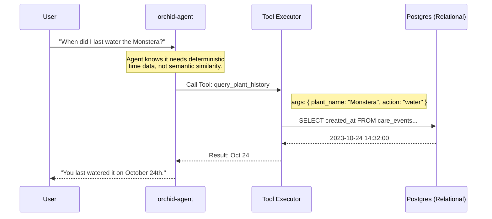

# Rethinking "2100": Why Vector Databases Fail the Orchid Paradigm

In the previous design (`PGVECTOR_MIGRATION.md`), we assumed that adding a vector index (`pgvector`) was the ultimate evolution of Orchid's memory. A critical analysis reveals that for a highly structured, entity-driven application like plant care, **vectors are the wrong tool for the job.**

Here is an analysis of why probabilistic vector search fails Orchid, and the truly efficient "2100" alternative: The **Deterministic Entity Graph**.

---

## 1. The Fundamental Flaw of Vectors (Probabilistic vs. Deterministic)

When a user asks Orchid, *"When did I last water the Monstera?"*

### What a Vector Database Does (Bad)
It embeds the query and searches the HNSW index for the closest semantic matches.
It will likely return:
1. "You should water the Monstera every 2 weeks." (High similarity, wrong answer).
2. "I watered the Calathea." (High similarity, wrong plant).
3. "Did I water the Monstera?" (An old question from the user, identical semantic space).

Vector similarity measures *topical closeness*, not factual correctness. It relies on the LLM to sift through highly related but potentially contradictory or outdated statements.

### What Orchid Actually Needs (Good)
A deterministic query: `SELECT created_at FROM care_events WHERE profile_id = X AND plant_id = Y AND action = 'water' ORDER BY created_at DESC LIMIT 1`.

Orchid's memory is inherently relational. Plants are discrete entities. Care actions are discrete events. Time is an absolute scalar. Vectors are notoriously terrible at exact matches, metadata filtering (unless using complex hybrid search), and temporal reasoning.

---

## 2. The Maintenance & Cost Burden

Even with a perfectly designed polymorphic pointer index, vectors carry heavy overhead:
1. **Compute Cost:** Every single user interaction must be sent to an embedding API (`text-embedding-3-small`), incurring latency and API costs *before* the LLM can even start thinking.
2. **RAM Overhead:** HNSW indexes must be kept entirely in RAM to be fast. As the `semantic_index` grows, it will consume expensive Supabase database memory, leading to potential eviction or slow disk reads.
3. **The "Update" Problem:** If a user insight is proven wrong ("Actually, my Monstera is fine, it was just dusty"), the vector index holds the old, high-similarity "sick Monstera" node forever unless we build complex semantic pruning logic.

---

## 3. The 2100 Solution: LLM-Driven Graph Querying

Instead of forcing structured data into unstructured vectors, the 2100 approach is to give the LLM the tools to navigate the structured data autonomously. We move from **"Push Context"** (dumping 5 tiers or 10 vectors into the prompt) to **"Pull Context"** (the LLM requests exactly what it needs).

### Architecture: The Semantic Layer (Text-to-Query)

We already have a highly normalized database schema (`profiles`, `plants`, `care_events`, `user_insights`). The "2100" gap is not the database; it's the *interface* to the database.

1. **Expose Read Tools, Not Just Write Tools:** Currently, `orchid-agent` has tools like `logCareEvent` and `modifyPlant`. We need to give the agent *Read* tools.
   * `query_plant_history(plant_id, event_type, limit)`
   * `search_user_insights(topic)`

2. **Dynamic Context Assembly (Agentic RAG):**
   When the user asks *"When did I last water the Monstera?"*:
   * The Agent realizes it needs facts.
   * It calls `query_plant_history(monstera_id, 'water', 1)`.
   * The edge function executes the exact SQL.
   * The Agent receives `[{ date: "2023-10-24T10:00:00Z" }]` and responds deterministically.

### Data Flow: Deterministic Retrieval

---

## Summary: Why Deterministic Graphs Win

| Feature | Vector (pgvector) | Relational Graph + Read Tools |
| :--- | :--- | :--- |
| **Accuracy** | Probabilistic (Fuzzy matches) | Deterministic (Exact truth) |
| **Time Queries** | Very Poor ("When did...") | Excellent (ORDER BY date) |
| **Cost / Latency** | High (Requires Embedding API call) | Very Low (Standard B-Tree Index lookup) |
| **Memory Footprint** | Heavy (HNSW index in RAM) | Lightweight (Standard Postgres indexes) |
| **Maintenance** | Complex (Syncing, pruning stale data) | Zero (It's just the live database) |

**Conclusion:** The 2100 evolution of Orchid is not a shift to vector databases. It is a shift in *agency*. By exposing deterministic database read-tools to the LLM (Agentic RAG) rather than injecting fuzzy vector text, we guarantee 100% factual accuracy, zero hallucination on plant history, and sub-millisecond query latency.
